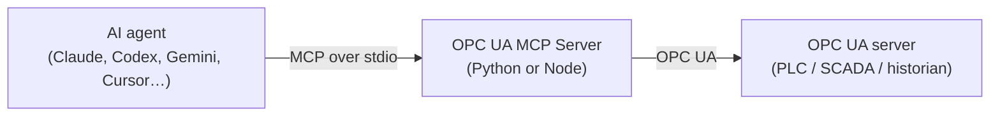

<div align="center">

# 🏭 OPC UA MCP Server

**Let Claude, Codex, Gemini and any other MCP agent read sensors, browse the plant and — only when you allow it — control equipment on any OPC UA server.**

[](https://www.npmjs.com/package/opcua-mcp-server)
[](https://pypi.org/project/opcua-mcp-server/)
[](https://www.npmjs.com/package/opcua-mcp-server)
[](https://github.com/IndustriAgents/OPCUA-MCP/actions/workflows/ci.yml)
[](https://modelcontextprotocol.io)
[](LICENSE)

[Quick start](#quick-start) · [Connect your agent](#connect-your-agent) · [Tools](#tools) · [Production](#going-to-production) · [Docs](#documentation)

</div>


## Features

- 🔌 **Any OPC UA server** — PLC, SCADA gateway or historian. Nothing to install on the plant side.
- 🧰 **The whole operator toolkit** — read, browse, history and aggregates, subscriptions, events and alarms, writes and method calls.
- 🛡️ **Read-only by default** — writes and method calls need an explicit profile, an allowlist and a pinned server certificate, and every control call is audited.
- 🐍 **Python or Node** — two first-class runtimes with the same tools and the same answers. [Use whichever you have](docs/install.md#which-runtime-am-i-installing).
- 📦 **One-file Claude Desktop install** — a `.mcpb` bundle with nothing else to set up.



## Quick start

Every MCP client runs the same command, with your endpoint in `OPCUA_SERVER_URL`:

```bash
npx -y opcua-mcp-server      # Node 22.13+
uvx opcua-mcp-server         # Python 3.10+
```

1. **Add it to your agent** — pick yours [below](#connect-your-agent).
2. **Point it at a server** — `opc.tcp://<host>:4840`, or [start the bundled mock plant](#try-it-without-a-plant).
3. **Ask** — *"What's the current temperature in the reactor vessel?"*

## Connect your agent

Replace `opc.tcp://localhost:4840` with your endpoint. To use the Python runtime,
swap `npx -y opcua-mcp-server` for `uvx opcua-mcp-server`.

<details>
<summary><b>Claude Desktop</b></summary>

**Easiest — the bundle.** Download `opcua-mcp-server-<version>.mcpb` from the
[latest release](https://github.com/IndustriAgents/OPCUA-MCP/releases/latest),
drag it into **Settings → Extensions**, and fill in **OPC UA endpoint**. No
Node, no Python, no JSON.

**Or let the server write the config** (needs Node or Python):

```bash
npm install -g opcua-mcp-server      # or: uv tool install opcua-mcp-server
opcua-mcp-server --install claude-desktop --url opc.tcp://192.168.0.10:4840
```

It writes absolute paths, because Claude Desktop does not inherit your shell's
`PATH`. Add `--dry-run` to preview. Editing `claude_desktop_config.json` by hand
and fixing a server that fails to start: [docs/install.md](docs/install.md).

</details>

<details>
<summary><b>Claude Code</b></summary>

```bash
claude mcp add opcua -e OPCUA_SERVER_URL=opc.tcp://localhost:4840 -- npx -y opcua-mcp-server
```

Add `--scope project` to share it with your team through `.mcp.json`.

</details>

<details>
<summary><b>OpenAI Codex</b></summary>

```bash
codex mcp add opcua --env OPCUA_SERVER_URL=opc.tcp://localhost:4840 -- npx -y opcua-mcp-server
```

Or add it to `~/.codex/config.toml`:

```toml
[mcp_servers.opcua]
command = "npx"
args = ["-y", "opcua-mcp-server"]
env = { OPCUA_SERVER_URL = "opc.tcp://localhost:4840" }
```

</details>

<details>
<summary><b>Gemini CLI</b></summary>

Add to `~/.gemini/settings.json`, or `.gemini/settings.json` in a project:

```json
{
  "mcpServers": {
    "opcua": {
      "command": "npx",
      "args": ["-y", "opcua-mcp-server"],
      "env": { "OPCUA_SERVER_URL": "opc.tcp://localhost:4840" }
    }
  }
}
```

</details>

<details>
<summary><b>Google Antigravity</b></summary>

In the agent panel, open **⋯ → MCP Servers → Manage MCP Servers → View raw
config**, add the entry below to `mcp_config.json`, and restart Antigravity:

```json
{
  "mcpServers": {
    "opcua": {
      "command": "npx",
      "args": ["-y", "opcua-mcp-server"],
      "env": { "OPCUA_SERVER_URL": "opc.tcp://localhost:4840" }
    }
  }
}
```

</details>

<details>
<summary><b>Cursor</b></summary>

Add to `~/.cursor/mcp.json`, or `.cursor/mcp.json` in a project:

```json
{
  "mcpServers": {
    "opcua": {
      "command": "npx",
      "args": ["-y", "opcua-mcp-server"],
      "env": { "OPCUA_SERVER_URL": "opc.tcp://localhost:4840" }
    }
  }
}
```

</details>

<details>
<summary><b>VS Code (GitHub Copilot)</b></summary>

Add to `.vscode/mcp.json` — note the top-level key is `servers`:

```json
{
  "servers": {
    "opcua": {
      "type": "stdio",
      "command": "npx",
      "args": ["-y", "opcua-mcp-server"],
      "env": { "OPCUA_SERVER_URL": "opc.tcp://localhost:4840" }
    }
  }
}
```

</details>

<details>
<summary><b>Windsurf</b></summary>

Add to `~/.codeium/windsurf/mcp_config.json`:

```json
{
  "mcpServers": {
    "opcua": {
      "command": "npx",
      "args": ["-y", "opcua-mcp-server"],
      "env": { "OPCUA_SERVER_URL": "opc.tcp://localhost:4840" }
    }
  }
}
```

</details>

<details>
<summary><b>Any other MCP client</b></summary>

Most clients accept this `mcpServers` entry. The server speaks MCP over stdio.

```json
{
  "mcpServers": {
    "opcua": {
      "command": "npx",
      "args": ["-y", "opcua-mcp-server"],
      "env": { "OPCUA_SERVER_URL": "opc.tcp://localhost:4840" }
    }
  }
}
```

</details>

> [!TIP]
> **No Node or Python on the machine?** Download a single-file executable from the
> [latest release](https://github.com/IndustriAgents/OPCUA-MCP/releases/latest)
> and use its path as the `command` — see [docs/install.md](docs/install.md).
> **Several PLCs?** Each entry talks to one endpoint, so add one entry per PLC
> ([why](docs/configuration.md#one-process-one-endpoint)).

## Try it without a plant

The repo ships a simulated industrial plant — sensors, actuators, methods,
history and events — so you can try every tool without touching real equipment:

```bash
git clone https://github.com/IndustriAgents/OPCUA-MCP.git && cd OPCUA-MCP
uv sync --all-packages
uv run --no-sync opcua-mock-server     # opc.tcp://localhost:4840/freeopcua/server/
```

Point your agent at that URL. The [MCP Inspector walkthrough](docs/testing.md)
has prompts to try, and the [compatibility matrix](docs/compatibility.md) lists
two smaller mocks for aggregates and alarms.

## What you can ask

- *"Show me all the variables in the system."*
- *"What was the temperature over the last hour? Give me the hourly average."*
- *"Watch the tank level and tell me what it does over the next minute."*
- *"What alarms are active right now?"*
- *"Set the valve position to 80%."* — needs the `operator` profile
- *"Start production on line 1 at 100 units/hour."* — needs the `operator` profile

Every reading comes back with its data type, status, timestamps and engineering
units — never a bare number. [What a result looks like](docs/tools.md#what-comes-back).

## Tools

<!-- BEGIN GENERATED: tool-summary from contract/tools.json by packages/server-node/scripts/config-artifacts.mjs. Do not edit by hand: edit the source, then run `npm run config:generate` in packages/server-node. -->

**15 tools**, identical on both runtimes and defined once in [`contract/tools.json`](contract/tools.json). Arguments, results and limits: [docs/tools.md](docs/tools.md).

| Access | Offered under | Tools |
|---|---|---|
| **read** | every profile, including the default `observe` | `read_opcua_nodes` · `browse_opcua_nodes` · `read_opcua_history` † · `read_event_history` † · `get_server_status` · `list_subscriptions` · `list_active_alarms` |
| **monitor** | every profile, including the default `observe` | `subscribe_opcua_nodes` · `unsubscribe_opcua_nodes` · `subscribe_events` · `read_events` |
| **alarm-action** | `operator` with `OPCUA_ALLOW_ACKNOWLEDGE_ALARMS`, or `full` | `acknowledge_alarm` · `act_on_alarm` |
| **control** | `operator`, for allowlisted targets only, or `full` | `write_opcua_nodes` · `call_opcua_method` |

Control and alarm tools also need a verified server (a secured channel and a pinned `OPCUA_SERVER_CERT`) unless a lab override is set. † Works only on a server that advertises the feature it needs, such as historical access.

<!-- END GENERATED: tool-summary -->

## Going to production

> [!WARNING]
> Out of the box the agent can only read, but the OPC UA channel is
> **unencrypted and anonymous** — fine for the mock or a lab, not for real
> equipment. Secure the channel before connecting to anything that matters.

**1. Secure the channel and pin the server** — add these to the `env` block:

```bash
OPCUA_SECURITY_POLICY=Basic256Sha256     # implies SignAndEncrypt
OPCUA_CLIENT_CERT=/etc/opcua/client.pem  # this client's identity
OPCUA_CLIENT_KEY=/etc/opcua/client_key.pem
OPCUA_SERVER_CERT=/etc/opcua/server.pem  # pin the server you meant to reach
OPCUA_USERNAME=mcp-operator              # or OPCUA_USER_CERT for X.509
OPCUA_PASSWORD=…
```

**2. Decide what the agent may do** with `OPCUA_PROFILE`:

| Profile | What the agent can do |
|---|---|
| `observe` *(default)* | Read, browse, history, subscriptions, events. No writes, no method calls. |
| `operator` | The above, plus **only** the nodes and methods you allowlist in `OPCUA_ALLOWED_WRITE_NODES` / `OPCUA_ALLOWED_METHODS`. |
| `full` | Every tool. Only for a tightly scoped OPC UA account. |

**3. Keep a record** — set `OPCUA_AUDIT_FILE` for an append-only log of every
control call.

Misconfiguration stops the server at startup with a message naming the variable,
rather than failing later against live equipment. The MCP policy is defence in
depth, not a replacement for OPC UA authorisation: scope the OPC UA account to the
same nodes and methods.

Every setting, value bounds on writes and allowlists that survive a server
restart: **[docs/configuration.md](docs/configuration.md)**. Threat model:
**[SECURITY.md](SECURITY.md)**. Certificates: **[docs/certificates.md](docs/certificates.md)**.

## Documentation

| Guide | What's inside |
|---|---|
| [Install](docs/install.md) | The `.mcpb` bundle, single-file executables, choosing a runtime, troubleshooting |
| [Configuration](docs/configuration.md) | Every setting, profiles, allowlists, value bounds, secure connections, reconnection |
| [Tools](docs/tools.md) | Full tool reference, result shapes, request limits, partial results |
| [Examples](docs/examples.md) | Every tool with real calls and responses against the mock plant |
| [Security](SECURITY.md) | What is and is not verified, the audit trail, reporting a vulnerability |
| [Certificates](docs/certificates.md) | Generating a client certificate a server will accept |
| [Compatibility](docs/compatibility.md) | Servers tested, and where the Python and Node runtimes differ |
| [Architecture](docs/architecture.md) | How it fits together, and why |
| [Testing](docs/testing.md) | The test suite, MCP Inspector and agent walkthroughs |
| [Roadmap](ROADMAP.md) · [Changelog](CHANGELOG.md) | What is next, and what has landed |

## Contributing

Contributions are welcome — see **[CONTRIBUTING.md](CONTRIBUTING.md)** for the
project layout, local development and adding a tool to both runtimes.

The most useful thing you can send is a result from a real OPC UA server: open a
[compatibility report](https://github.com/IndustriAgents/OPCUA-MCP/issues/new?template=compatibility_report.md)
saying which server, which version and which tools worked. Test only on equipment
you are authorised to use, and keep writes and method calls to a simulator or lab.

## License

MIT — see [LICENSE](LICENSE).
