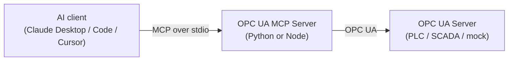

<div align="center">

# 🏭 OPC UA MCP Server

**Read industrial sensors and control equipment on any OPC UA server — through natural language with Claude and any MCP client.**

[](https://www.npmjs.com/package/opcua-mcp-server)
[](https://pypi.org/project/opcua-mcp-server/)
[](https://www.npmjs.com/package/opcua-mcp-server)
[](https://github.com/IndustriAgents/OPCUA-MCP/actions/workflows/ci.yml)
[](LICENSE)
[](https://github.com/IndustriAgents/OPCUA-MCP)

[](https://www.python.org)
[](https://nodejs.org)
[](https://modelcontextprotocol.io)
[](CONTRIBUTING.md)

[Quick Start](#quick-start) · [Install](docs/install.md) · [Tools](#tools) · [Examples](docs/examples.md) · [Compatibility](docs/compatibility.md) · [Architecture](docs/architecture.md) · [Testing](docs/testing.md) · [Roadmap](ROADMAP.md) · [Contributing](CONTRIBUTING.md)

</div>


## Overview

[MCP tools](#tools) over plain OPC UA: read and write nodes, browse the address
space, call methods, read history and server-side aggregates, and subscribe to
data changes, events and alarms. It connects to any server that speaks OPC UA —
PLC, SCADA gateway or historian.

What is actually offered on a given connection depends on three things: what the
server advertises it can do, what the OPC UA account is permitted to do, and
which [tool profile](#deciding-what-the-agent-may-do) you configured. The default
profile is read-only.

There are **two first-class implementations**, Python and TypeScript/Node, held
to one shared contract, one test suite and one release gate — same tools, same
arguments, same responses, same version, released together. Install whichever
your machine already has. Where the two genuinely differ — two extra security
policies on Node, the Claude Desktop bundle being Node, the MCP protocol
generation each SDK speaks, how a dropped connection is repaired — the
difference is declared and listed in
**[docs/compatibility.md](docs/compatibility.md#runtime-differences)**; anything
else that differs is a bug. Some such bugs are known and being fixed — the same
page lists them, with the input habits that avoid them (zone-qualified
timestamps, numbers sent as numbers). Why both, and what each is promised:
[ADR 0001](docs/adr/0001-two-first-class-runtimes.md).

Which servers and operations the test suite exercises, and which are only
reported by users, is set out in
**[docs/compatibility.md](docs/compatibility.md)**.

**One process talks to one endpoint.** `OPCUA_SERVER_URL` is read once at
startup, every tool targets it, and the only transport is stdio — so the server
runs beside the MCP client that started it, and each client gets its own OPC UA
session. That is the right shape for an engineer at a workstation, which is what
this is built for. A site with five PLCs runs five entries in the client config,
and if OPC UA sessions are a licensed resource on your equipment, count on one
per client per endpoint. What it would take to be a shared plant-wide gateway
instead is set out in the [roadmap](ROADMAP.md#considered-and-set-aside).



## Quick Start

**Claude Desktop, nothing installed?** Download the `.mcpb` bundle from the
[latest release](https://github.com/IndustriAgents/OPCUA-MCP/releases/latest) and
drag it into **Settings → Extensions**. It carries the server and every
dependency, Claude Desktop supplies the runtime, and the OPC UA endpoint is a
field in the settings form — no Node, no Python, no JSON to edit.

**Already have a runtime?** Install the package and let it write the config:

```bash
npm install -g opcua-mcp-server        # or: uv tool install opcua-mcp-server
opcua-mcp-server --install claude-desktop --url opc.tcp://192.168.0.10:4840
```

`--install` writes absolute paths rather than a bare `npx`, which matters more
than it sounds: Claude Desktop is launched from the GUI and does not inherit a
login shell's `PATH`. `--dry-run` shows the result without writing it. Without a
permanent install, `npx` and `uvx` fetch the package on demand.

**Prefer to configure it yourself?** Add this to your MCP client config and point
`OPCUA_SERVER_URL` at your OPC UA endpoint:

```json
{
  "mcpServers": {
    "opcua": {
      "command": "npx",
      "args": ["-y", "opcua-mcp-server"],
      "env": { "OPCUA_SERVER_URL": "opc.tcp://localhost:4840" }
    }
  }
}
```

<details>
<summary>Python instead of Node, or Claude Code in one line</summary>

The two runtimes are held to the same contract and the same tests — same tools,
same arguments, same responses — so this is mostly a question of what is already
on the machine. The exceptions are declared in the
[runtime differences](docs/compatibility.md#runtime-differences) list. For the
Python package, swap the command:

```json
{ "command": "uvx", "args": ["opcua-mcp-server"] }
```

Claude Code needs no file at all:

```bash
claude mcp add opcua -e OPCUA_SERVER_URL=opc.tcp://localhost:4840 -- npx -y opcua-mcp-server
```

</details>

Single-file executables for machines with no runtime and no network, and what to
do when Claude Desktop cannot start the server:
**[docs/install.md](docs/install.md)**.

> **No OPC UA server to hand?** This repo ships a mock industrial plant — see
> [Try it against the mock](#try-it-against-the-mock).

## Tools

<!-- BEGIN GENERATED: tool-reference from contract/tools.json by packages/server-node/scripts/config-artifacts.mjs. Do not edit by hand: edit the source, then run `npm run config:generate` in packages/server-node. -->

Both runtimes expose the same **15 tools** — 7 read, 4 monitor, 2 alarm-action and 2 control — defined once in [`contract/tools.json`](contract/tools.json).

| Tool | Access | Hints | What it does |
|---|---|---|---|
| `read_opcua_nodes` | read | read-only, idempotent | Read the current value of one or more OPC UA nodes in a single request. |
| `browse_opcua_nodes` | read | read-only, idempotent | Explore the OPC UA address space: list a node's children, walk a subtree, resolve a human-readable browse path to a node ID, or search for nodes by name. |
| `read_opcua_history` † | read | read-only, idempotent | Read what a node's value has been over time. |
| `read_event_history` † | read | read-only, idempotent | Read events the OPC UA server stored, for a time range that has already passed. |
| `get_server_status` | read | read-only, idempotent | Report whether this MCP server is connected to the OPC UA server and what that server says about itself: its endpoint and connection security, its ServerStatus (state, current time, start time, build info) and its NamespaceArray as index -> URI. |
| `list_subscriptions` | read | read-only, idempotent | List the active OPC UA data-change subscriptions, each with the value changes buffered for it since it was created. |
| `list_active_alarms` | read | read-only, idempotent | List the alarm and condition instances the server is currently retaining — those that are active, unacknowledged, or both. |
| `subscribe_opcua_nodes` | monitor | — | Watch one or more OPC UA nodes for value changes instead of polling them. |
| `unsubscribe_opcua_nodes` | monitor | — | Cancel one or more active data-change subscriptions and discard what they had buffered. |
| `subscribe_events` | monitor | — | Start buffering OPC UA events (alarms, condition changes, plain events) from a notifier node. |
| `read_events` | monitor | — | Read the events buffered by subscribe_events, oldest first. |
| `acknowledge_alarm` | alarm-action | — | Acknowledge an alarm or condition, identified by the event_id of the event that reported it (from list_active_alarms or read_events). |
| `act_on_alarm` | alarm-action | — | Confirm, annotate or shelve an alarm — the rest of the operator workflow that acknowledge_alarm starts. |
| `write_opcua_nodes` | control | destructive, idempotent | Write a value to one or more OPC UA nodes. |
| `call_opcua_method` | control | destructive | Call a method on an OPC UA object. |

**Access** decides which `OPCUA_PROFILE` offers a tool. `read` and `monitor` tools are offered under every profile, including the default `observe`. `control` tools need `operator`, which offers them only for allowlisted targets, or `full`; `alarm-action` tools need `operator` with `OPCUA_ALLOW_ACKNOWLEDGE_ALARMS`, or `full`. Both also need a secured channel unless `OPCUA_ALLOW_INSECURE_CONTROL` is set. **Hints** are the MCP tool annotations each tool advertises.

† **Capability-gated**: listed only when the connected server advertises what it needs — `read_opcua_history` on `AccessHistoryDataCapability` or `AggregateFunctions`; `read_event_history` on `AccessHistoryEventsCapability`.

<!-- END GENERATED: tool-reference -->

A capability-gated tool is not on the menu of a server that cannot do it,
rather than failing at call time. `read_opcua_history` is offered for either
stored values or server-side aggregates (a non-empty `AggregateFunctions`
folder); its `aggregate_function` argument appears only with the latter, and its
description then lists the functions that server actually offers.
`read_event_history` is gated separately — keeping values and keeping events are
different features, and a server commonly does one without the other.

**One tool per operation, not one per arity.** Reading one node and reading fifty
is the same request with a longer list, so it is one tool and one code path.
Batching is the caller's choice, not a different API.

Both servers also expose one **resource**, `opcua://subscriptions`: the same
records `list_subscriptions` returns, re-readable without spending a tool call.

### How much one call may ask for

Every request is bounded before anything reaches the OPC UA server, and a request
over a bound is refused whole with a message naming the limit and the value —
never truncated, never partly sent. The numbers live in `contract/tools.json` ->
`limits`, so both runtimes enforce the same ones.

| Limit | Value | Bounds |
|---|---|---|
| `maxNodesPerRead` | 500 | `node_ids` of one `read_opcua_nodes` call (also the schema's `maxItems`) |
| `maxNodesPerWrite` | 100 | `nodes` of one `write_opcua_nodes` call (also `maxItems`) |
| `maxMethodArguments` | 64 | `arguments` of one `call_opcua_method` call (also `maxItems`) |
| `maxHistoryValues` | 5000 | Raw readings or stored events per history call, and intervals per aggregate read |
| `maxSubscriptions` | 200 | Data-change subscriptions held at once |
| `maxEventBufferSize` | 10000 | `subscribe_events` `buffer_size` — clamped, and reported as clamped |
| `maxRequestBytes` | 1 MiB | A call's arguments, as compact UTF-8 JSON |
| `maxStringBytes` | 128 KiB | Any one string, anywhere in the arguments |
| `maxByteStringBytes` | 64 KiB | Any one ByteString value, once its base64 is decoded |
| `maxArrayItems` | 10000 | Any one array, anywhere in the arguments |
| `maxNestingDepth` | 8 | How deeply arrays and objects nest, counting the arguments object |

The OPC UA server's own `OperationLimits` can only lower these. Reads are sent in
chunks of the server's `MaxNodesPerRead`, in order, each node keeping its own
status. A write batch over the server's `MaxNodesPerWrite` is **refused rather than
split**: a batch is one Write, OPC UA already lets one Write partially succeed
without rolling anything back, and splitting it would add a case where the first
part moved the plant and the second never arrived. A write is not a transaction
either way — read the per-node statuses.

### Results that say whether they are whole

A result that can hold fewer records than the request covered — a history read at
its `num_values`, a browse at `max_nodes`, an event buffer that overflowed, a
subscription whose ring buffer discarded old changes — carries a `completeness`
object beside `result` in `structuredContent`:

```
{ "complete": false, "reasons": ["requestLimit"], "returned": 2, "truncated": true,
  "limit": 2, "dropped": 0, "remaining": true,
  "continuation": { "start_time": "2026-09-24T10:00:01.123Z" } }
```

**Test `complete`; never infer completeness from how many records came back.**
`reasons` says why not (`requestLimit`, `contractLimit`, `serverLimit`,
`bufferOverflow`, `unbrowsable`), `dropped` counts records a buffer lost before the
read, and `continuation` is arguments to merge into the same call to get the rest
— stateless, so it cannot go stale or outlive a session. The tools that carry it
are `read_opcua_history`, `read_event_history`, `read_events`,
`browse_opcua_nodes` and the three subscription tools; the shape is
`contract/tools.json` -> `completeness`.

Full per-tool reference with inputs, outputs and a node-ID map:
**[docs/examples.md](docs/examples.md)**.

## Example usage in conversation

Once configured, you can ask in plain language:

- *"What's the current temperature reading from the reactor vessel?"*
- *"Set the valve position to 80%"*
- *"Show me all available variables in the system"*
- *"What was the temperature over the last hour?"*
- *"Start production on line 1 at 100 units/hour"*
- *"Give me the hourly average temperature for today"*
- *"Watch the tank level and tell me what it does over the next minute"*
- *"What alarms are active right now?"*
- *"Acknowledge the high-temperature alarm — I'm looking into it"*
- *"That level switch has cycled 40 times in an hour. Shelve it for half an hour."*

Every answer comes back as a record, not prose. A reading carries its data type,
its OPC UA status and both timestamps — because quality and age are what decide
whether a value can be acted on, and a bare number carries neither:

```
read_opcua_nodes  node_ids=["ns=2;i=3", "ns=2;i=12"]
→ { "node_id": "ns=2;i=3", "value": 23.10, "data_type": "Double", "status": "Good",
    "source_timestamp": "2026-09-10T13:15:12.214Z",
    "server_timestamp": "2026-09-10T13:15:12.214Z",
    "engineering": { "unit": "°C", "unit_description": "degree Celsius",
                     "eu_range": { "low": 0, "high": 150 },
                     "instrument_range": { "low": -50, "high": 250 } } }
  { "node_id": "ns=2;i=12", "value": true, "data_type": "Boolean", "engineering": null, … }
```

`engineering` is what the plant says the number *means*, read from the node's own
OPC UA properties: `23.10` cannot be told from °C, PSI or %, and cannot be told
from a trip. It is `null` for a node that publishes none, which is most of them —
only an `AnalogItemType` carries it. The range is not only reported: a write
outside the node's own `EURange` is refused before anything is sent, which is a
safety bound the equipment declared rather than one a human retyped.

A walk of the address space says whether it finished, so a partial answer can
never pass for a complete one — in the record, and in the `completeness` object
every partial-capable tool returns beside it:

```
browse_opcua_nodes  depth=4  node_class="Variable"  include_values=true
→ { "nodes": [ { "node_id": "ns=2;i=3", "browse_name": "2:Temperature",
                 "node_class": "Variable", "data_type": "Double", "value": 26.34, … } ],
    "truncated": false, "inspected": 22 }
  completeness: { "complete": true, "reasons": [], … }
```

**Every tool declares a result shape**, and both runtimes are held to it. The
shapes live in `contract/tools.json`; the suite checks each runtime's *actual*
output against them and then diffs the two runtimes against each other — so a
client that has learned one server's answers can read the other's.

A per-node rejection is a status inside a successful result, never a failed call:
one unreadable node in a batch of fifty must not discard the other forty-nine.
Only a failure of the whole operation is an error.

Events are collected, not pushed: MCP is request/response, so `subscribe_events`
starts a real OPC UA subscription in the background and `read_events` hands over
what has arrived since you last asked. `list_active_alarms` does not need one —
it asks the server for its retained conditions directly (ConditionRefresh).

## Configuration

Both runtimes read the same environment variables. Their canonical, machine-readable
definition — type, choices, default, whether the value is secret, which runtimes
read it — is [`contract/config.json`](contract/config.json): the tables below,
the Claude Desktop bundle's settings form and the MCP Registry's `server.json` are
generated from it, and the unit suite fails if either runtime reads a variable it
does not declare.

<!-- BEGIN GENERATED: config-reference from contract/config.json by packages/server-node/scripts/config-artifacts.mjs. Do not edit by hand: edit the source, then run `npm run config:generate` in packages/server-node. -->

26 settings in six groups. A blank value means the default, whatever the type; a boolean accepts `1`, `true`, `yes`, `on` and `0`, `false`, `no`, `off`.

**Connection** — Which OPC UA server to talk to.

| Variable | Default | Description |
|---|---|---|
| `OPCUA_SERVER_URL` | `opc.tcp://localhost:4840` | URL of the OPC UA server to connect to, including any path the server expects. Read once at startup: one process serves one endpoint. Nothing verifies who answers at this address unless the server certificate is pinned. |

**Channel security** — How the OPC UA secure channel is signed, encrypted and verified.

| Variable | Default | Description |
|---|---|---|
| `OPCUA_SECURITY_POLICY` | `None` | Encryption suite to negotiate for the secure channel. Anything other than None needs a client certificate and key. The two AES suites are Node-only: the Python runtime refuses them at startup rather than downgrading. One of `None`, `Basic128Rsa15`, `Basic256`, `Basic256Sha256`, `Aes128_Sha256_RsaOaep`, `Aes256_Sha256_RsaPss`. None is unencrypted and unauthenticated, and keeps control tools blocked unless insecure control is explicitly allowed. An unknown policy stops the server at startup. |
| `OPCUA_SECURITY_MODE` | SignAndEncrypt once a security policy is set, otherwise None | Message security mode for the secure channel. Sign authenticates messages without encrypting them. One of `None`, `Sign`, `SignAndEncrypt`. A policy with mode None, or a mode without a policy, stops the server at startup; leaving it blank never downgrades a policy to signing only. |
| `OPCUA_CLIENT_CERT` | — | Path to the certificate (PEM or DER) this client presents as its application identity. Required by any security policy other than None. A path that does not exist stops the server at startup. |
| `OPCUA_CLIENT_KEY` | — | Path to the private key matching the client certificate. A path, never key material. Whoever can read the file can impersonate this client: keep it readable only by the account running the server. A path that does not exist stops the server at startup. |
| `OPCUA_APPLICATION_URI` | the subjectAltName URI of the client certificate | Application URI announced to the server. Set it only for a certificate that carries no URI of its own: a server may reject a session whose URI does not match the certificate. |
| `OPCUA_SERVER_CERT` | — | Path to the OPC UA server's own certificate (PEM or DER), pinned: a server presenting any other certificate cannot complete the handshake. Control tools (writes, method calls, alarm actions) require it. Requires a security policy other than None. Unset, encryption protects against eavesdropping but not against an impostor endpoint, so control tools are refused unless OPCUA_ALLOW_UNVERIFIED_SERVER_CONTROL is set. Set without a security policy, it stops the server at startup rather than pinning nothing; a pinned certificate that has expired or is not yet valid refuses to connect. |

**User identity** — Who the OPC UA session logs in as.

| Variable | Default | Description |
|---|---|---|
| `OPCUA_USERNAME` | — | OPC UA username. The session is anonymous when unset. Cannot be combined with a user certificate. Requires a password; either one alone stops the server at startup. |
| `OPCUA_PASSWORD` | — | **Secret.** Password for the username. Without a security policy it crosses the network in clear text. Supply it through the client's secret storage, never on a command line. |
| `OPCUA_USER_CERT` | — | Path to the certificate identifying the user, for X.509 user authentication: a different key pair from the client certificate, which secures the channel. Requires the user key and a security policy other than None; cannot be combined with a username. Any of those combinations broken stops the server at startup. |
| `OPCUA_USER_KEY` | — | Path to the private key for the user certificate. It signs the server's challenge and is never sent. Whoever can read the file can log in as this user: keep it readable only by the account running the server. |

**Tool policy** — Which MCP tools are offered, and what a control tool may touch.

| Variable | Default | Description |
|---|---|---|
| `OPCUA_PROFILE` | `observe` | Which tools are offered. observe reads, browses, reads history and monitors; operator adds explicitly allowlisted writes, method calls and alarm actions; full exposes every tool and is meant only for a tightly scoped OPC UA account. One of `observe`, `operator`, `full` (`read-only` means `observe`; `readonly` means `observe`). Unset fails closed to observe; an unknown profile stops the server at startup. |
| `OPCUA_POLICY_FILE` | — | Path to a version-1 JSON policy file, the only place per-node value bounds can be set. Every policy variable that is set overrides what the file says. An unreadable or invalid file stops the server at startup. |
| `OPCUA_ALLOWED_TOOLS` | — | Comma-separated tool allowlist. It can only narrow the selected profile, never widen it. An unknown tool name stops the server at startup. |
| `OPCUA_ALLOWED_WRITE_NODES` | — | Comma-separated exact node IDs the operator profile may write, as ns=2;i=5 or, stable across a server restart, nsu=&lt;namespace-uri>;i=5. Setting it replaces the policy file's list, bounds included. Empty fails closed: operator can write nothing. A batch write with any target outside the list is refused before it reaches OPC UA. |
| `OPCUA_ALLOWED_METHODS` | — | Comma-separated object_node_id\|method_node_id pairs the operator profile may call. Empty fails closed: operator can call nothing. An entry without \| stops the server at startup. |
| `OPCUA_ALLOW_ACKNOWLEDGE_ALARMS` | `false` | Let the operator profile act on alarms: acknowledge_alarm and every act_on_alarm action. |
| `OPCUA_ALLOW_INSECURE_CONTROL` | `false` | Permit control tools on an OPC UA channel with no security policy (None). Does not cover a secured channel to an unverified server; that is OPCUA_ALLOW_UNVERIFIED_SERVER_CONTROL. Fail-open override: writes, method calls and alarm actions then travel unauthenticated and unencrypted. Reported as control=INSECURE-OVERRIDE in the startup line, get_server_status and every audit record. Never enable it against production equipment. |
| `OPCUA_ALLOW_UNVERIFIED_SERVER_CONTROL` | `false` | Permit control tools on a secured OPC UA channel whose server certificate is not pinned with OPCUA_SERVER_CERT. Does not cover a channel with no security policy; that is OPCUA_ALLOW_INSECURE_CONTROL. Fail-open override: writes, method calls and alarm actions are then encrypted to whichever server answered the endpoint, which may be an impostor. Reported as control=UNVERIFIED-OVERRIDE in the startup line, get_server_status and every audit record. Never enable it against production equipment. |
| `OPCUA_ALLOW_OUT_OF_RANGE_WRITES` | `false` | Allow a write outside the EURange the OPC UA server itself published for the node. Fail-open override: it discards the only value bound a deployment with no policy file has. |

**Audit** — Where the control audit trail goes, and what it is labelled with.

| Variable | Default | Description |
|---|---|---|
| `OPCUA_AUDIT_FILE` | — | Path to an append-only file for the control audit trail, one JSON object per line, written beside stderr. Created if it does not exist. A file that cannot be opened stops the server rather than falling back to stderr alone. |
| `OPCUA_OPERATOR_ID` | — | Label stamped on every audit record, so a shipped log says which deployment a control call came from. A label, not a verified identity. |

**Reconnection** — How a refused or dropped connection is retried.

| Variable | Default | Description |
|---|---|---|
| `OPCUA_RECONNECT_INITIAL_DELAY_MS` | `1000` | Wait before the first attempt to repair a dropped or refused connection, in milliseconds. It doubles with each further attempt. |
| `OPCUA_RECONNECT_MAX_DELAY_MS` | `8000` | Ceiling for the doubling retry delay, in milliseconds. |
| `OPCUA_RECONNECT_MAX_RETRY` | `3` | Retries after the first attempt, per connection round, before a tool call gives up: a whole number from -1 to 1000. 0 never retries; -1 never stops trying, in bounded rounds of four retries so no single call waits forever. |
| `OPCUA_SESSION_TIMEOUT_MS` | `60000` | Session lifetime asked of the OPC UA server, in milliseconds. It also sets the keep-alive period, so it decides how quickly an idle connection notices the server has gone. |

<!-- END GENERATED: config-reference -->

### Staying connected

Neither server needs restarting when the OPC UA server does. A dropped
connection is retried with exponential backoff on the four
`OPCUA_RECONNECT_*` / `OPCUA_SESSION_TIMEOUT_MS` settings above, the read and
write paths transparently re-establish a dead session, and the data-change
subscriptions an agent is holding are re-created on the new session — the IDs
keep working and the values already buffered are still there to be read. The
two runtimes get there differently: node-opcua repairs a dropped channel in the
background and keeps the same session, while the Python runtime rebuilds a fresh
session when the next call needs one. The settings mean the same on both; see
[runtime differences](docs/compatibility.md#runtime-differences).

Event subscriptions are re-created on a new session too, and the next `read_events` adds a
note that events raised while the connection was down were not received
(`read_event_history` can recover them from a server that stores them).

Stopped by `SIGTERM` or `SIGINT`, either server deletes its subscriptions and
closes the session before exiting 0, waiting at most five seconds for an OPC UA
server that has stopped answering.

Plant connectivity never gates the MCP protocol. Both servers answer
`initialize` at once and make their first connection in the background; a
`tools/list` or `get_server_status` that arrives while that first round is
still running waits for it for at most 3 seconds, so against a reachable plant
the first catalogue is already the whole one, and against an unreachable one
the server is diagnosable straight away. After that, reconnection is driven by
tool calls rather than by a timer: the next call that needs a session connects.
`get_server_status` is the one tool that answers either way — it reports
`connected: false` and the reason instead of failing (including "still
connecting" while a round is running, which it reports rather than waits for),
and every other tool's error points at it.

Retrying happens in *rounds*: one attempt plus `OPCUA_RECONNECT_MAX_RETRY`
retries, the delays doubling from `OPCUA_RECONNECT_INITIAL_DELAY_MS` up to
`OPCUA_RECONNECT_MAX_DELAY_MS`. A tool call that needs a session waits for at
most one round and then fails with "Not connected to the OPC UA server at …".
The defaults (three retries, 1–8s apart) keep that short. Raise
`OPCUA_RECONNECT_MAX_RETRY` (up to 1000) for a site where outages are measured
in minutes; the last waiting a call will do is the sum of the delays. `-1` means
never give up — every later call starts another round — but each round is still
four retries long, so no single request, and not the server's start-up, can wait
forever.

### Deciding what the agent may do

Three profiles, and the default is the restrictive one:

| `OPCUA_PROFILE` | What it offers |
|---|---|
| `observe` *(default)* | Read, browse, history and monitoring. No writes, no methods |
| `operator` | The above, plus **only** the write targets and methods you allowlist |
| `full` | Every tool |

`operator` is the one worth understanding. A write to a node outside
`OPCUA_ALLOWED_WRITE_NODES` is refused before anything reaches OPC UA, and one
forbidden target rejects an entire batch rather than letting part of it through.
Both `operator` and `full` also require a **verified server**: a security
policy *and* the server's certificate pinned with `OPCUA_SERVER_CERT`. Encrypted
is not enough — without the pin the channel is encrypted to whoever answered.
Two lab-only overrides say otherwise in as many words, one per missing property:
`OPCUA_ALLOW_INSECURE_CONTROL=true` for a channel with no security, and
`OPCUA_ALLOW_UNVERIFIED_SERVER_CONTROL=true` for a secured one to an unpinned
server. A refused control call names the variable to set, and
`get_server_status` → `server_identity` says which of the three is in force
([SECURITY.md](SECURITY.md#control-needs-a-verified-server)).

The policy is enforced again on **every call**, not only when tools are listed —
an MCP client may hold a stale catalogue, and a hidden tool is a usability
feature rather than a security boundary. Every control call is also recorded —
with its targets, its outcome, the endpoint it went to and the session it rode
on — to stderr and, if `OPCUA_AUDIT_FILE` is set, to an owner-only append-only
file beside it, fsync'd per record. A control call whose record cannot be written
is refused rather than sent; reads carry on. `OPCUA_AUDIT_CHAIN` adds an optional
hash chain that `opcua-mcp-server --verify-audit` checks. What that file can and
cannot prove — it is not a tamper-proof or authenticated record of *who* — is in
[SECURITY.md](SECURITY.md#what-the-local-audit-file-can-and-cannot-prove).

### Bounding the value, not only the node

An allowlist says *where* a write may go. It does not say *what* may be written,
and for the one product category where a wrong number is a physical event that is
the weaker half: a model that has correctly identified the right setpoint and
hallucinated `9999` instead of `99.9` is fully allowlisted.

Two bounds now apply.

**The one the plant published.** An OPC UA `AnalogItemType` carries an `EURange` —
what the value holds in normal operation. Both servers read it, report it on every
reading, and refuse a write outside it before anything is sent. No configuration:
the equipment set the bound. Set `OPCUA_ALLOW_OUT_OF_RANGE_WRITES=true` for the
deployments that write outside normal operation on purpose.

**The one you write.** In a policy file, a `writable_nodes` entry may carry `min`,
`max`, `enum` or `max_change`:

```json
{
  "control": {
    "writable_nodes": [
      "nsu=urn:plant:line-a;s=Line1.SpeedSetpoint",
      { "node": "nsu=urn:plant:line-a;s=Line1.Temperature", "min": 0, "max": 120 },
      { "node": "nsu=urn:plant:line-a;s=Line1.Mode", "enum": ["AUTO", "MANUAL"] }
    ]
  }
}
```

A bare node id stays legal. Both bounds apply, so a policy can only ever narrow
what the equipment already allows. `OPCUA_ALLOWED_WRITE_NODES` is a comma-separated
list and cannot express a bound — a bounded node needs the file. The full shape is
in **[SECURITY.md](SECURITY.md#bounding-the-value-not-only-the-node)**.

### Writing an allowlist that stays correct

`OPCUA_ALLOWED_WRITE_NODES` and `OPCUA_ALLOWED_METHODS` accept two forms:

```
ns=2;i=5                       # namespace index — resolved per session
nsu=urn:plant:line-a;i=5       # namespace URI — stable across sessions
```

**Prefer the second.** A namespace *index* is not a property of a node; it is
that node's position in the server's NamespaceArray for the current session. A
firmware update, an added namespace or a reordered load can move it — and an
allowlist written `ns=2;i=5` then authorises writes to a **different physical
node**, with nothing anywhere reporting that anything changed.

The namespace URI is the stable name. Both servers read the NamespaceArray on
every connect and resolve URI-pinned entries against it, so the allowlist follows
the node rather than the index. An entry naming a URI the server does not
publish matches nothing and is reported on stderr at connect time.

Spelling does not matter: `i=2253` and `ns=0;i=2253` are the same node, entries
are trimmed, and both runtimes canonicalise identically (pinned by
`tests/fixtures/node-id-forms.json`).

Larger deployments can put all of it in a version-1 JSON file
(`OPCUA_POLICY_FILE`) instead of the environment; the shape, and a worked
example, are in **[SECURITY.md](SECURITY.md#tool-profiles-and-control-policy)**.

### Connecting securely

The defaults are unencrypted and unauthenticated, which suits the mock plant and
nothing else. A real deployment wants a policy, a client certificate, an identity
and a pinned server certificate — the last is what control tools require:

```bash
OPCUA_SECURITY_POLICY=Basic256Sha256     # implies SignAndEncrypt
OPCUA_CLIENT_CERT=/etc/opcua/client.pem  # this server's identity
OPCUA_CLIENT_KEY=/etc/opcua/client_key.pem
OPCUA_SERVER_CERT=/etc/opcua/server.pem  # pin the server you meant to reach
OPCUA_USERNAME=mcp-operator              # or OPCUA_USER_CERT for X.509
OPCUA_PASSWORD=…
```

Names are case-insensitive, and a policy on its own implies `SignAndEncrypt`.
Anything the OPC UA spec cannot honour — a mode without a policy, a policy
without a certificate, a username without a password, a path that does not exist
— is refused at startup with a message naming the variable, rather than failing
later against live equipment.

`OPCUA_USERNAME` / `OPCUA_PASSWORD` authenticate the session but encrypt nothing:
without a security policy the password crosses the network in clear text unless
the server's user-token policy protects it, and both servers say so on stderr.
Pair credentials with a policy.

Why each of these matters, what is still not protected, and the full X.509 story:
**[SECURITY.md](SECURITY.md)**. Generating a certificate a server will accept —
including a file-naming trap on the Python runtime — is
**[docs/certificates.md](docs/certificates.md)**.

## Try it against the mock

The repo ships a simulated industrial plant — sensors, actuators, methods,
history and events — so you can try the tools without touching real equipment.

```bash
git clone https://github.com/IndustriAgents/OPCUA-MCP.git && cd OPCUA-MCP
uv sync --all-packages
uv run --no-sync opcua-mock-server     # opc.tcp://localhost:4840/freeopcua/server/
```

Point your MCP client at that URL — [`.mcp.json.example`](.mcp.json.example) is a
ready-made config. Two smaller mocks cover what the main one deliberately does
not model, server-side aggregates and acknowledgeable alarms; the
[compatibility matrix](docs/compatibility.md) says which covers what, and
[docs/testing.md](docs/testing.md) has an MCP Inspector walkthrough with example
prompts.

## Development & testing

```bash
uv sync --all-packages                      # one-time workspace setup
cd tests
uv run --no-sync pytest unit/               # fast, no server needed (<1s)
uv run --no-sync pytest                     # unit + end-to-end, both runtimes
uv run --no-sync pytest -m smoke smoke/     # published-artifact smoke tests
```

Full guide, including the MCP Inspector and AI-agent walkthroughs:
**[docs/testing.md](docs/testing.md)**. Project layout and how to add a tool:
**[CONTRIBUTING.md](CONTRIBUTING.md)**. How it fits together:
**[docs/architecture.md](docs/architecture.md)**.

## Security

> [!WARNING]
> Both runtimes default to an **observe-only** tool profile, but the OPC UA
> connection itself still defaults to `SecurityPolicy.None` and
> `MessageSecurityMode.None` — unauthenticated and unencrypted. That combination
> is for the bundled mock and local development. For production, configure both
> channel security and an `operator` allowlist — see the two sections above. Control tools
> need the OPC UA server's certificate pinned (`OPCUA_SERVER_CERT`), not only an encrypted
> channel: encryption says nobody can read the traffic, the pin says who is on the other end.
> Each can be waived for a lab by its own explicit override, and never by the other's.

See [SECURITY.md](SECURITY.md) for the security posture, what the servers do and
do not verify, and how to report a vulnerability;
[docs/certificates.md](docs/certificates.md) for client certificates and trust
setup.

The MCP policy is defense in depth, not a replacement for OPC UA authorization.
Scope the OPC UA account to the same nodes and methods; use a separate read-only
account for `observe` deployments.

## Contributing

Contributions are welcome — see **[CONTRIBUTING.md](CONTRIBUTING.md)** for
project layout, local development, adding a new tool to both servers, and PR
conventions. What is planned next is in [ROADMAP.md](ROADMAP.md); changes that
have landed are tracked in [CHANGELOG.md](CHANGELOG.md).

Results from a real OPC UA server are the most useful thing to send: open a
[compatibility report](https://github.com/IndustriAgents/OPCUA-MCP/issues/new?template=compatibility_report.md)
saying which server, which version and which tools worked. Test only on
equipment you are authorised to use, and keep writes and method calls to a
simulator or lab.

## License

MIT — see [LICENSE](LICENSE).
