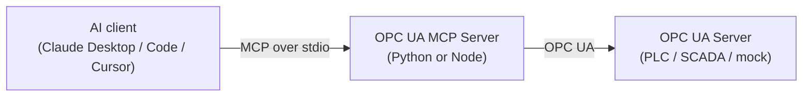

<div align="center">

# 🏭 OPC UA MCP Server

**Read industrial sensors and control equipment on any OPC UA server — through natural language with Claude and any MCP client.**

[](https://www.npmjs.com/package/opcua-mcp-server)
[](https://pypi.org/project/opcua-mcp-server/)
[](https://www.npmjs.com/package/opcua-mcp-server)
[](https://github.com/midhunxavier/OPCUA-MCP/actions/workflows/ci.yml)
[](LICENSE)
[](https://github.com/midhunxavier/OPCUA-MCP)

[](https://www.python.org)
[](https://nodejs.org)
[](https://modelcontextprotocol.io)
[](CONTRIBUTING.md)

[Quick Start](#quick-start) · [Install](docs/install.md) · [Tools](#tools) · [Examples](docs/examples.md) · [Architecture](docs/architecture.md) · [Testing](docs/testing.md) · [Contributing](CONTRIBUTING.md)

</div>


## Overview

Two interchangeable implementations — **Python** and **TypeScript/Node** — expose
the same OPC UA operations as MCP tools: read and write nodes, browse the address
space, call methods, read history and server-side aggregates, and subscribe to
events and alarms. Both connect to any OPC UA server. Pick whichever runtime fits
your stack.



## Quick Start

**Claude Desktop, nothing installed?** Download the `.mcpb` bundle from the
[latest release](https://github.com/midhunxavier/OPCUA-MCP/releases/latest) and
drag it into **Settings → Extensions**. It carries the server and every
dependency, Claude Desktop supplies the runtime, and the OPC UA endpoint is a
field in the settings form — no Node, no Python, no JSON to edit. There are
[single-file executables](docs/install.md#2-single-file-executable--no-runtime-at-all)
too, for machines with no runtime and no network.

**Already have a runtime?** Install the package and let it write the config:

```bash
npm install -g opcua-mcp-server        # or: uv tool install opcua-mcp-server
opcua-mcp-server --install claude-desktop --url opc.tcp://192.168.0.10:4840
```

**Prefer to configure it yourself?** Add one of these to your MCP client config
and point `OPCUA_SERVER_URL` at your OPC UA endpoint.

**Node** (via `npx`):

```json
{
  "mcpServers": {
    "opcua": {
      "command": "npx",
      "args": ["-y", "opcua-mcp-server"],
      "env": { "OPCUA_SERVER_URL": "opc.tcp://localhost:4840" }
    }
  }
}
```

**Python** (via [`uvx`](https://docs.astral.sh/uv/)):

```json
{
  "mcpServers": {
    "opcua": {
      "command": "uvx",
      "args": ["opcua-mcp-server"],
      "env": { "OPCUA_SERVER_URL": "opc.tcp://localhost:4840" }
    }
  }
}
```

For Claude Code, one command does it:

```bash
claude mcp add opcua -e OPCUA_SERVER_URL=opc.tcp://localhost:4840 -- npx -y opcua-mcp-server
```

All four routes, and what to do when Claude Desktop cannot start the server:
**[docs/install.md](docs/install.md)**.

> **No OPC UA server to hand?** This repo ships a mock industrial plant — see
> [Try it against the mock](#try-it-against-the-mock).

## Tools

Both servers expose the same sixteen tools, defined once in
[`contract/tools.json`](contract/tools.json) so they cannot drift apart.

| Tool | What it does |
|---|---|
| `read_opcua_node` | Read a single node's value |
| `write_opcua_node` | Write a value to a node |
| `read_multiple_opcua_nodes` | Batch read |
| `write_multiple_opcua_nodes` | Batch write |
| `browse_opcua_node_children` | List a node's children |
| `call_opcua_method` | Invoke a method on an object node |
| `get_all_variables` | Inventory every variable in the address space |
| `subscribe_opcua_node` | Watch a node for data changes instead of polling it |
| `list_subscriptions` | The active subscriptions, each with its buffered changes |
| `unsubscribe_opcua_node` | Cancel one subscription |
| `subscribe_events` | Start collecting events from a notifier node |
| `read_events` | Read the events collected since the last read |
| `list_active_alarms` | The alarms the server is currently retaining |
| `acknowledge_alarm` | Acknowledge one of them, with a comment |
| `read_history_opcua_node` † | Read historical, timestamped values |
| `read_aggregate_opcua_node` † | Server-computed aggregates (Average, Min, Max, …) |

† **Capability-gated.** These appear only when the connected server advertises
support — history via `AccessHistoryDataCapability`, aggregates via a non-empty
`AggregateFunctions` folder. Against a server without them, the tools are simply
not offered rather than failing at call time.

Both servers also expose one **resource**, `opcua://subscriptions`: the same
records `list_subscriptions` returns, re-readable without spending a tool call.

Full per-tool reference with inputs, outputs and a node-ID map:
**[docs/examples.md](docs/examples.md)**.

## Example usage in conversation

Once configured, you can ask in plain language:

- *"What's the current temperature reading from the reactor vessel?"*
- *"Set the valve position to 80%"*
- *"Show me all available variables in the system"*
- *"What was the temperature over the last hour?"*
- *"Start production on line 1 at 100 units/hour"*
- *"Give me the hourly average temperature for today"*
- *"Watch the tank level and tell me what it does over the next minute"*
- *"What alarms are active right now?"*
- *"Acknowledge the high-temperature alarm — I'm looking into it"*

Real responses from the bundled mock plant, via the published package:

```
read_opcua_node   node_id="ns=2;i=3"
→ Node ns=2;i=3 value: 23.101165241243347

write_opcua_node  node_id="ns=2;i=13"  value="80"
→ Successfully wrote 80 to node ns=2;i=13

get_all_variables
→ Found 22 variables:

  - Name: Temperature
    NodeID: ns=2;i=3
    Object ID: ns=2;i=2
    Value: 26.34449150525422
    Data Type: ns=0;i=11
    Description: Temperature
  …

read_history_opcua_node  node_id="ns=2;i=3"  num_values=2
→ { "value": 24.231991377989036, "timestamp": "2026-09-10T13:15:12.214Z", "status": "Good" }
  { "value": 26.089859958260515, "timestamp": "2026-09-10T13:15:11.208Z", "status": "Good" }

subscribe_opcua_node  node_id="ns=2;i=3"  publishing_interval=500
→ { "subscription_id": "sub-1", "node_id": "ns=2;i=3", "publishing_interval": 500,
    "sampling_interval": 500, "buffer_size": 20, "change_count": 0, "changes": [] }

list_subscriptions            # a few seconds later
→ { "subscription_id": "sub-1", …, "change_count": 4, "changes": [
      { "value": 25.33, "timestamp": "2026-09-10T13:15:11.478Z", "status": "Good" },
      { "value": 26.05, "timestamp": "2026-09-10T13:15:12.481Z", "status": "Good" }, … ] }

list_active_alarms
→ { "event_id": "ZjW7HJrVSFzDV2sMsX7sEQAAAAE=",
    "event_type": "ns=0;i=9341",
    "source_node": "ns=1;i=1001",
    "source_name": "Temperature",
    "time": "2026-09-10T13:15:12.214Z",
    "message": "Condition is 100.000 and state is High",
    "severity": 700,
    "condition_id": "ns=1;i=1002",
    "condition_name": "HighTemperatureAlarm",
    "active": true, "acked": false, "retain": true }

acknowledge_alarm  event_id="ZjW7HJrVSFzDV2sMsX7sEQAAAAE="  comment="on it"
→ Acknowledged alarm ns=1;i=1002 (event ZjW7HJrVSFzDV2sMsX7sEQAAAAE=)
```

Both runtimes return that same record shape — one record per historical value —
for `read_history_opcua_node` and `read_aggregate_opcua_node` alike, one for the
subscription family and one for the event family (`read_events`,
`list_active_alarms`). All three are defined in `contract/tools.json`
(`resultShapes`) and enforced against both servers by the test suite.

Events are collected, not pushed: MCP is request/response, so `subscribe_events`
starts a real OPC UA subscription in the background and `read_events` hands over
what has arrived since you last asked. `list_active_alarms` does not need one —
it asks the server for its retained conditions directly (ConditionRefresh), and
says so plainly when the server has no Alarms & Conditions support to ask.

Bad input is rejected identically by both runtimes:

```
read_history_opcua_node  node_id="ns=2;i=3"  start_time="2026-02-30T00:00:00Z"
→ Error: Invalid date/time: "2026-02-30T00:00:00Z". Use ISO 8601, e.g. 2026-04-23T17:40:00Z
```

## Configuration

Both runtimes read the same environment variables:

| Variable | Default | Meaning |
|---|---|---|
| `OPCUA_SERVER_URL` | `opc.tcp://localhost:4840` | OPC UA endpoint to connect to |
| `OPCUA_SECURITY_POLICY` | `None` | `None`, `Basic128Rsa15`, `Basic256`, `Basic256Sha256` — plus `Aes128_Sha256_RsaOaep` and `Aes256_Sha256_RsaPss` on the Node runtime |
| `OPCUA_SECURITY_MODE` | `SignAndEncrypt` once a policy is set, otherwise `None` | `None`, `Sign` or `SignAndEncrypt` |
| `OPCUA_CLIENT_CERT` | — | Client certificate (PEM/DER). Required for any policy other than `None` |
| `OPCUA_CLIENT_KEY` | — | Private key for `OPCUA_CLIENT_CERT` |
| `OPCUA_APPLICATION_URI` | the `subjectAltName` URI of `OPCUA_CLIENT_CERT` | Application URI announced to the server. Set it only for a certificate that carries no URI of its own |
| `OPCUA_USERNAME` | — | Username identity; the session is anonymous when unset |
| `OPCUA_PASSWORD` | — | Password for `OPCUA_USERNAME` |

Encrypted, authenticated connection to a real server:

```json
{
  "mcpServers": {
    "opcua": {
      "command": "npx",
      "args": ["-y", "opcua-mcp-server"],
      "env": {
        "OPCUA_SERVER_URL": "opc.tcp://plc.example.internal:4840",
        "OPCUA_SECURITY_POLICY": "Basic256Sha256",
        "OPCUA_CLIENT_CERT": "/etc/opcua/client.pem",
        "OPCUA_CLIENT_KEY": "/etc/opcua/client_key.pem",
        "OPCUA_USERNAME": "mcp-operator",
        "OPCUA_PASSWORD": "…"
      }
    }
  }
}
```

Names are case-insensitive, and a policy on its own implies `SignAndEncrypt`.
Anything the OPC UA spec cannot honour — a mode without a policy, a policy
without a certificate, a username without a password — is refused at startup
with a message naming the variable, rather than failing later against live
equipment. The server certificate is taken from the endpoint description during
the handshake, so no server certificate file is needed.

Generating a client certificate the server will accept, and getting it into its
trust list, is **[docs/certificates.md](docs/certificates.md)**.

`OPCUA_USERNAME` / `OPCUA_PASSWORD` authenticate the session but encrypt
nothing: without a security policy the password crosses the network in clear
text unless the server's user-token policy protects it, and both servers say so
on stderr. Pair credentials with a policy.

On the **Python runtime**, certificate and key files are parsed as PEM only when
they are named `*.pem` and as DER otherwise (a `python-opcua` rule), so a PEM key
called `client.key` fails to load — name it `client_key.pem`. The Node runtime
sniffs the contents and accepts either name.

## Installation

Most users need only the [Quick Start](#quick-start) above — `npx` and `uvx`
fetch the package on demand. To install it permanently:

```bash
# Node
npm install -g opcua-mcp-server
opcua-mcp-server            # also available as: opcua-mcp

# Python
uv tool install opcua-mcp-server   # or: pip install opcua-mcp-server
opcua-mcp-server
```

Either command, once installed, can register itself with Claude Desktop:

```bash
opcua-mcp-server --install claude-desktop --url opc.tcp://192.168.0.10:4840
```

That writes absolute paths rather than a bare `npx`, which matters more than it
sounds: Claude Desktop is launched from the GUI and does not inherit a login
shell's `PATH`. `--dry-run` shows the result without writing it. Downloadable
artifacts for machines with no runtime at all — the `.mcpb` bundle and the
single-file executables — are covered in **[docs/install.md](docs/install.md)**.

| | Python | Node |
|---|---|---|
| Requires | Python 3.10+ | Node 22.13+ |
| Package | [PyPI `opcua-mcp-server`](https://pypi.org/project/opcua-mcp-server/) | [npm `opcua-mcp-server`](https://www.npmjs.com/package/opcua-mcp-server) |
| Framework | `mcp` (`MCPServer`) | `@modelcontextprotocol/sdk` |
| OPC UA library | `opcua` (FreeOpcUa) | `node-opcua-client` |
| Source | `packages/server-python/` | `packages/server-node/` |

Exact dependency versions live in the manifests
([`pyproject.toml`](packages/server-python/pyproject.toml),
[`package.json`](packages/server-node/package.json)) rather than being restated
here, where they would drift.

## Try it against the mock

The repo ships a simulated industrial plant — sensors, actuators, methods,
history and alarm events — so you can try the tools without touching real
equipment.

```bash
git clone https://github.com/midhunxavier/OPCUA-MCP.git && cd OPCUA-MCP
uv sync --all-packages
uv run --no-sync opcua-mock-server     # listens on opc.tcp://localhost:4840/freeopcua/server/
```

Then point your MCP client at
`opc.tcp://localhost:4840/freeopcua/server/`. See
[`.mcp.json.example`](.mcp.json.example) for a ready-made config, and
[docs/testing.md](docs/testing.md) for an MCP Inspector walkthrough and example
prompts.

## Development & testing

```bash
uv sync --all-packages                      # one-time workspace setup
cd tests
uv run --no-sync pytest unit/               # fast, no server needed (<1s)
uv run --no-sync pytest                     # unit + end-to-end, both runtimes
uv run --no-sync pytest -m smoke smoke/     # published-artifact smoke tests
```

Full guide, including the MCP Inspector and AI-agent walkthroughs:
**[docs/testing.md](docs/testing.md)**. Project layout and how to add a tool:
**[CONTRIBUTING.md](CONTRIBUTING.md)**. How it fits together:
**[docs/architecture.md](docs/architecture.md)**.

## Security

> [!WARNING]
> Both runtimes **default** to `SecurityPolicy.None` and
> `MessageSecurityMode.None` — **unauthenticated and unencrypted**. That default
> is fine for the bundled mock and local development. **Do not point it at
> production industrial equipment as-is** — set `OPCUA_SECURITY_POLICY` and
> credentials as shown under [Configuration](#configuration). Both servers print
> a warning to stderr while running without security.

See [SECURITY.md](SECURITY.md) for the security posture, what the servers do and
do not verify, and how to report a vulnerability;
[docs/certificates.md](docs/certificates.md) for client certificates and trust
setup.

Note also that this server can **write** to nodes and **call methods** on real
equipment. Scope the OPC UA user account you connect with to exactly what you
intend the assistant to be able to do.

## Contributing

Contributions are welcome — see **[CONTRIBUTING.md](CONTRIBUTING.md)** for
project layout, local development, adding a new tool to both servers, and PR
conventions. Changes are tracked in [CHANGELOG.md](CHANGELOG.md).

## License

MIT — see [LICENSE](LICENSE).
