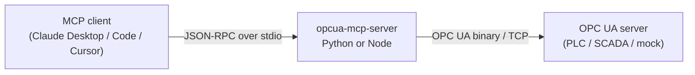

# Architecture

How the pieces fit together, and the three invariants that are easy to break.



## Two runtimes, one tool surface

The repo ships the same MCP server twice — once in Python, once in
TypeScript/Node. They are interchangeable: same tool names, same descriptions,
same parameters, same error wording. Users pick whichever runtime their stack
already has.

That interchangeability is not maintained by discipline. It is maintained by
`contract/tools.json`, the single source of truth for the tool surface:

| | How it uses the contract |
|---|---|
| **Node** | Builds its `tools/list` response directly from it. `npm run build` copies it to `build/contract.json` so the npm package is self-contained. |
| **Python** | Reads tool descriptions and capability node IDs from it. Input schemas are derived by `MCPServer` from the function signatures, and checked against the contract by a test. |

The contract also pins what the tools *return*, where the answer is more than
free text. A tool names a shape from `resultShapes`; the history family
(`read_history_opcua_node`, `read_aggregate_opcua_node`) shares
`historyRecords`, one flat `{value, timestamp, status}` record per historical
value or aggregate interval, and the event family (`read_events`,
`list_active_alarms`) shares `eventRecords`. Encoding a value keys on the OPC UA
data type rather than the language one — python-opcua and node-opcua represent
the same reading with entirely different native types (a ByteString is `bytes`
vs a `Buffer`, an Int64 a plain int vs a `[high, low]` pair), so anything
reaching for the runtime type diverges by construction. `tests/fixtures/value-encoding.json`
is the shared table, and both unit suites build the native value for every case
in it and assert the same JSON comes out. That was the second half of interchangeability, and
for a while it was missing: both servers matched on names and parameters but the
Node one returned raw `node-opcua` `DataValue` JSON while the Python one returned
flat records, so a client that learned one misread the other.

`tests/e2e/test_contract_parity.py` starts both servers and asserts each
advertises exactly the contract's applicable tools, with matching descriptions
and parameter sets, and that what each actually returns satisfies the declared
`resultShape`. `tests/unit/test_contract.py` checks the contract file itself is
well-formed.

**Adding a tool** therefore means editing the contract, adding the per-tool logic
in each runtime, and adding a test — see [CONTRIBUTING.md](../CONTRIBUTING.md).
You never edit a tool list by hand.

The contract covers the **resource** surface too, under `resources`: a URI, name,
description and mimeType, plus a `body` naming the `resultShape` its document
carries. Both servers build their `resources/list` from that entry, and the
parity test reads the resource from each and checks it against the shape.

## Subscriptions: buffered, not pushed

An MCP tool call is request/response, so an OPC UA subscription cannot answer its
caller — the notifications arrive whenever the OPC UA server publishes, long
after `subscribe_opcua_node` returned. Each runtime therefore owns the
subscription and *buffers* what it delivers (`src/subscriptions.ts` /
`subscriptions.py`), and the agent reads the accumulation back through
`list_subscriptions` or the `opcua://subscriptions` resource.

The buffer is a ring of `buffer_size` records with a `change_count` beside it, so
an agent that looks away for a minute sees how much it missed rather than
silently losing it. One OPC UA subscription per monitored node, which is what
lets a single `unsubscribe_opcua_node` take the whole thing down rather than
leaving an empty subscription behind.

Teardown is not optional, and it is the part that is easy to get wrong: closing
the OPC UA session without deleting its subscriptions leaves the server
publishing into the void until their lifetime expires. Both runtimes delete
first, session second — Python in the lifespan's `finally`, Node on `SIGINT`,
`SIGTERM` *and* `server.onclose`, because the usual end of an MCP session is not
a signal at all but the client closing stdin.

### Why the subscriptions resource is polled, not pushed

Issue #3 asked for `notifications/resources/updated`. It is not offered, on
either runtime, because the two SDK generations no longer agree on what that
means: `@modelcontextprotocol/sdk` 1.x speaks the `resources/subscribe` +
`notifications/resources/updated` pair, while the Python `mcp` 2.x SDK removed
`resources/subscribe` as of protocol 2026-07-28 in favour of
`subscriptions/listen` streams, which the Node SDK does not serve. Under a
current Python client the Python server's `notify_resource_updated` is dropped on
the floor and the client sees nothing.

Shipping the notification on one runtime only would break the interchangeability
this repo is built around, so neither does it. The re-readable resource is the
contract, on both; it is what the parity test enforces, and it is what
`docs/examples.md` documents. If the SDKs converge, this becomes an additive
change on top.

## Capability gating

Some tools only make sense against servers that support them. Rather than
advertising a tool that always fails, each runtime probes the connected OPC UA
server at `tools/list` time and filters:

| Capability | Probe | Gates |
|---|---|---|
| `history` | Read `AccessHistoryDataCapability` (`ns=0;i=11193`) is true | `read_history_opcua_node` |
| `aggregate` | Browse `AggregateFunctions` (`ns=0;i=2997`) is non-empty | `read_aggregate_opcua_node` |

The probes are **best-effort by design**: any failure yields "not supported"
rather than an error. A transient OPC UA outage must not strip the core tools
from `tools/list`.

> There are three mocks, on purpose. The main one (`packages/mock-server/`,
> :4840) enables history and advertises **no** aggregate functions, so the suite
> can assert the aggregate tool stays hidden when unsupported. The second
> (`packages/mock-server-aggregate/`, :4841) advertises aggregates, so the read
> path itself is covered on both runtimes. The third
> (`packages/mock-server-alarms/`, :4842) has a real alarm condition — see below.

The event tools are deliberately **not** gated. Every OPC UA server has a Server
object with an EventNotifier, and a server that raises nothing simply buffers
nothing; there is no capability to probe that would make hiding them more honest
than offering them. A server without Alarms & Conditions is told apart at call
time instead: `list_active_alarms` reports that its ConditionRefresh call failed
and that the server may not implement A&C, rather than returning an empty list a
model would read as "no alarms".

## Events and Alarms & Conditions

Events are buffered exactly as the data-change subscriptions above are, for the
same reason, and their subscriptions come down on the same teardown path:
`subscribe_events` starts an OPC UA subscription whose monitored item parks what
arrives, and `read_events` drains it. What differs is what is asked for — an
event filter rather than a monitored value — and that `list_active_alarms`
sidesteps the buffer entirely: it makes its own short-lived subscription, calls
ConditionRefresh, and collects the retained conditions the server replays
between the RefreshStart and RefreshEnd events.

`contract/tools.json` -> `events` is what keeps the two runtimes saying the same
thing: one list of OPC UA browse paths that is simultaneously the EventFilter
select clauses both servers send and the field order of an `eventRecords`
record. Two details of it are load-bearing and non-obvious:

- Every path is resolved against **BaseEventType**, which Part 4 §7.4.4.5 says
  makes a server evaluate it without regard to the event's own type. That is how
  one filter selects `AckedState/Id` from a condition and gets `null` — rather
  than an error — from a plain event, and so how one record shape covers both.
- **ConditionId** is not a component of ConditionType at all; it is the NodeId
  attribute of the condition instance, selected with an empty browse path. It is
  also what `acknowledge_alarm` calls the Acknowledge method on, so getting it
  wrong is not cosmetic — the tool would have nothing to acknowledge.

`acknowledge_alarm` takes only the `event_id` a model has just seen, because both
servers remember which condition each event they reported came from. The
condition can still be passed explicitly for an event that came from somewhere
else.

## The three invariants

**1. `stdout` belongs to the transport.** MCP speaks JSON-RPC over stdio; a stray
`print()` or `console.log` corrupts the stream and the client disconnects with a
parse error. Python logs to `stderr` explicitly; the Node server reassigns
`console.log` to `console.error` at startup, because `node-opcua` logs PKI and
certificate messages on its own.

**2. Nothing hardcodes a version.** The version is single-sourced from each
package manifest — Node stages it into `build/version.json` at build time, Python
reads its installed distribution metadata. `tests/unit/test_version_manifests.py`
fails the build if a literal reappears or the manifests drift apart.

**3. The published artifact is what users get, not the source tree.** Paths that
resolve in a checkout may not resolve in a wheel or a tarball, and a dependency
range that resolves to one major today may resolve to a breaking one tomorrow.
Both have already shipped bugs here. `tests/smoke/` builds the real artifacts,
installs them in isolation, and drives the installed entry points from outside
the repo.

There are now five such artifacts, and the two newest stray furthest from the
source tree: the `.mcpb` bundle inlines the contract and bundles
node-opcua-client's whole CommonJS dependency tree into one file, and the
single-file executables freeze an interpreter around it. Both can break while every other test stays
green, so both are built and driven over MCP in `tests/smoke/`. See
[install.md](install.md) for what each artifact is for.

## Layout

```
contract/tools.json          single source of truth for the tool + resource surface
packages/server-python/      mcp MCPServer + opcua (FreeOpcUa)
  src/opcua_mcp_server/      config · security · contract · datetimes
                             · capabilities · aggregates · records
                             · subscriptions · events · version · install
                             · cli · server
  packaging/                 PyInstaller spec for the single-file executable
packages/server-node/        @modelcontextprotocol/sdk + node-opcua-client
  src/                       config · security · contract · dates · records
                             · subscriptions · events · connection · tools
                             · install · index · sea
  mcpb/manifest.json         MCP bundle manifest (Claude Desktop extension)
  scripts/                   build steps: npm package · .mcpb · executable
packages/mock-server/        simulated PLC/sensors (:4840, no aggregates)
packages/mock-server-aggregate/  aggregate-capable mock (:4841)
packages/mock-server-alarms/     Alarms & Conditions mock (:4842)
tests/                       unit/ (fast) · e2e/ (both servers, secured and not)
                             · smoke/ (artifacts) · fixtures/ (secured mock, PKI)
examples/                    standalone demo scripts
```

## Security posture

Connection security is configured through the environment, by the same variables
on both runtimes: `OPCUA_SECURITY_POLICY`, `OPCUA_SECURITY_MODE`,
`OPCUA_CLIENT_CERT`, `OPCUA_CLIENT_KEY`, `OPCUA_USERNAME` and `OPCUA_PASSWORD`
(see [Configuration](../README.md#configuration)). Each runtime parses and
validates them in one module — `security.ts` / `security.py` — which the client
factory, the capability probes and the startup check all go through, so a
probe cannot end up on a different security footing than the session it
precedes.

Identity is derived rather than restated: with a client certificate configured,
both runtimes announce the `subjectAltName` URI of that certificate as the
session's ApplicationUri, which is the value servers check it against. That is
free on the Node side (node-opcua reads the certificate itself) and explicit on
the Python side (`certificate_application_uri`), because python-opcua would
otherwise announce its own `urn:freeopcua:client` and be refused by equipment the
Node runtime got into with the same files.

The **default is `None`/`None`**: unauthenticated and unencrypted, appropriate
for the bundled mock and local development and **not** appropriate for
production industrial systems. Both servers warn on stderr when running that
way. For what the secured path does and does not verify — notably that the
server certificate is not pinned — see [SECURITY.md](../SECURITY.md), and for
certificate generation and trust setup [certificates.md](certificates.md).
