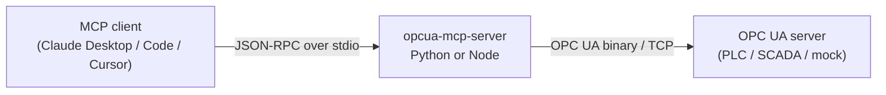

# Architecture

How the pieces fit together, and the three invariants that are easy to break.



## Two runtimes, one tool surface

The repo ships the same MCP server twice — once in Python, once in
TypeScript/Node. Both are first-class — the support promise, and what it costs,
is [ADR 0001](adr/0001-two-first-class-runtimes.md): same tool names, same
descriptions, same parameters, same error wording, one test suite and one release
gate for both. What the two do *not* share is declared in
`contract/runtime-differences.json` and listed in
[compatibility.md](compatibility.md#runtime-differences); anything else that
differs is a bug. Users pick whichever runtime their stack already has, or no
runtime at all via the bundle and executable routes in docs/install.md.

**Why twice**, though — because "pick your stack" is less and less of an answer,
as #122 noted when it added that last clause. Two of the four install routes need
no runtime at all, the `.mcpb` (the flagship Claude Desktop path) is Node-only,
and on the remaining two `npx -y` and `uvx` both bootstrap without a pre-existing
install. Fewer and fewer people are picking a runtime to match anything.

The reasons that do hold are worth stating plainly, because they are what decides
where effort goes:

- **Python is where the OPC UA and industrial-data ecosystem lives.** A plant
  integrator extending this, or reading it to learn how something is done, is
  more likely to be reading Python than TypeScript.
- **`python-opcua` is unmaintained** — see `transport_limits.py` and
  CVE-2022-25304, which this repo patches because no upstream fix exists or is
  expected. A second, independently implemented client is insurance against that
  library, not redundancy.

That framing changes what to optimise. The cost of two runtimes is real and
visible in the history: `0dd31b1 fix(node): mark tool failures as errors (#61)`
and `f8f9242 fix(python): mark tool failures as errors (#63)` are one bug, filed
twice and fixed twice. The answer is not to drop one but to keep pushing decisions
*into the contract* — reconnect defaults, dead-session status codes, the policy
schema, the retry policy — so each runtime shrinks toward a thin adapter over its
own client library, and the thing that has to be written twice gets smaller.

**One structural difference used to survive all of that**, because the contract
pins the tool surface and the tests pin the semantics and neither pins the shape
of the code. Node kept its state on objects — the connection, the tools and the
policy constructed in `index.ts` and passed down — while Python kept the same
state in module globals: the connection, the capability answers, the subscription
and event managers, the per-session node metadata, the audit sink, and a memoised
policy. So the Python server could not be instantiated twice in one process and
the Node one nearly could.

Both are instance-scoped now (#116). Python's state lives on a `ServerState` that
`PolicyMCPServer` owns; `list_tools` and `call_tool` reach it through `self`, and
the tools reach the same object through the lifespan context. The globals had been
justified on the grounds that `list_tools` is handed no `Context` — which is an
argument for putting them on the server instance, not in the module. Tool
*registration* moved into `create_server()` for the second half of the same
reason: a module-level `@mcp.tool` decorator binds a tool to whichever instance
existed at import, so with two instances the second would have had no tools at
all. On the Node side the two memoised singletons (`policy.ts` and `config.ts`)
became plain factories, with `index.ts` constructing one policy and passing it to
both halves.

That last part is not cosmetic, and it is the one place this refactor could have
introduced a bug rather than only moving code. The connection re-binds the
policy's namespace mapping on every (re)connect and `call_tool` authorizes against
it, so the two have to be the *same object* — otherwise an `nsu=<uri>;i=…`
allowlist entry is bound on one policy and resolved against another that has never
seen a NamespaceArray, and every write to it is silently denied. That held before
only because both callers happened to receive one memoised instance. It holds now
because the state owns one and hands it over. `tests/e2e/test_policy_e2e.py` drives
the `nsu=` form end to end on both runtimes for the first time, which is what turns
that from a claim into a check — it had no end-to-end coverage at all before,
because the bundled mock created its nodes at a bare namespace index without
publishing a URI for it. The mock registers one now.

None of this changes behaviour today; one stdio server per process is what MCP
asks for. What changed is that this is now one instance rather than the only
possible one, which is the precondition for pooled sessions and per-endpoint
policy.

That interchangeability is not maintained by discipline. It is maintained by
`contract/tools.json`, the single source of truth for the tool surface:

| | How it uses the contract |
|---|---|
| **Node** | Builds its `tools/list` response directly from it. `npm run build` copies it to `build/contract.json` so the npm package is self-contained. |
| **Python** | Builds its `tools/list` response from it too. `MCPServer` still derives a schema from each function signature — that is what it validates the call against — but what is *advertised* is the contract's own. |

For a while the Python half was weaker than that, and it cost exactly what you
would expect. Its advertised schemas were the signature-derived ones, which
carry no per-argument descriptions and flatten every nested structure:
`write_opcua_nodes` offered its `nodes` argument as "an array of object" against
a contract that names `node_id`, `value` and the fifteen legal `data_type`
spellings. Tool *descriptions* matched across the runtimes; the parameter
documentation a model needs in order to call the tool did not. The parity test
compared top-level property names, `required`, and each property's declared
type, so it passed. It now compares the whole schema, and both runtimes advertise
the same document.

Arguments are checked against that same schema before anything else happens, by
`validation.py` / `validation.ts` — a short function each over the nine JSON
Schema keywords the contract actually uses, driven by one shared table
(`tests/fixtures/argument-validation.json`) that both unit suites run. Three of
the nine were added after the fact, and each closed a hole: `additionalProperties`
(no schema forbade extras, so a misspelled *optional* argument was accepted and
silently changed behaviour — models misspell optional arguments), `enum`
(`node_class` and `data_type` are fixed sets, and an unknown node class used to
match nothing and come back as an empty list, indistinguishable from a subtree
that really is empty), and `minimum` (every numeric argument is floored at zero;
a negative is never meaningful and used to be silently clamped). The *ceilings*
stay clamps rather than refusals — they are documented caps on how much work one
call may ask for, and the result says when one was hit. Before
that, the Node runtime validated nothing at all (the low-level MCP `Server` does
not check `arguments` against the advertised `inputSchema`, and the dispatcher
cast straight off the wire), while the Python runtime validated against the
looser signature-derived schema and worded the refusal its own way.

The contract also pins what the tools *return*. **Every** tool names a shape
from `resultShapes` — ten of the then seventeen named none until 0.4.0, when the contract declared a shape for every tool and consolidated the count to thirteen, and for those
the output format, error wording and defaults were two hand-written copies that
no test compared, which is where every divergence between the two runtimes
turned out to live. `read_opcua_history` produces `historyRecords`, one flat
`{value, timestamp, status}` record per historical value or aggregate interval;
`read_events` and `list_active_alarms` share `eventRecords`. Encoding a value keys on the OPC UA
data type rather than the language one — python-opcua and node-opcua represent
the same reading with entirely different native types (a ByteString is `bytes`
vs a `Buffer`, an Int64 a plain int vs a `[high, low]` pair), so anything
reaching for the runtime type diverges by construction. `tests/fixtures/value-encoding.json`
is the shared table, and both unit suites build the native value for every case
in it and assert the same JSON comes out. That was the second half of interchangeability, and
for a while it was missing: both servers matched on names and parameters but the
Node one returned raw `node-opcua` `DataValue` JSON while the Python one returned
flat records, so a client that learned one misread the other.

`tests/e2e/test_contract_parity.py` starts both servers and asserts each
advertises exactly the contract's applicable tools, with matching descriptions
and byte-identical input schemas, and that what each actually returns satisfies
the declared `resultShape`. `tests/unit/test_contract.py` checks the contract
file itself is well-formed.

### Failures are part of the surface too

`resultShapes` pins what a tool returns when it works. Nothing pinned what it
returns when it does not, and the two runtimes had drifted: the Node server
wrapped every failure as `Error: <message>`, and the Python SDK wraps a
`ToolError` raised inside a tool body as `Error executing tool <name>: <message>`
— so one refusal reached a model as three different sentences depending on which
runtime and which code path produced it. The differential suite compared
*substrings*, which is how it survived being looked at.

`contract/tools.json` -> `errors` is now the wording, `errors.py` / `errors.ts`
only substitute into it, and neither runtime adds a frame of its own: `isError`
already says it is an error. `test_runtime_differential.py` drives a table of
failing calls through both servers and asserts the full text is equal. That
table is also what found the two behavioural differences behind the wording —
the Node runtime never re-checked capability gating at invocation time, and its
`read_opcua_history` reported "requires start_time" as a failure to *read* a node
it had not touched.

**Adding a tool** therefore means editing the contract, adding the per-tool logic
in each runtime, and adding a test — see [CONTRIBUTING.md](../CONTRIBUTING.md).
You never edit a tool list by hand.

The contract covers the **resource** surface too, under `resources`: a URI, name,
description and mimeType, plus a `body` naming the `resultShape` its document
carries. Both servers build their `resources/list` from that entry, and the
parity test reads the resource from each and checks it against the shape.

## Subscriptions: buffered, not pushed

An MCP tool call is request/response, so an OPC UA subscription cannot answer its
caller — the notifications arrive whenever the OPC UA server publishes, long
after `subscribe_opcua_nodes` returned. Each runtime therefore owns the
subscription and *buffers* what it delivers (`src/subscriptions.ts` /
`subscriptions.py`), and the agent reads the accumulation back through
`list_subscriptions` or the `opcua://subscriptions` resource.

The buffer is a ring of `buffer_size` records with a `change_count` beside it, so
an agent that looks away for a minute sees how much it missed rather than
silently losing it. One OPC UA subscription per monitored node, which is what
lets a single `unsubscribe_opcua_nodes` take the whole thing down rather than
leaving an empty subscription behind.

Teardown is not optional, and it is the part that is easy to get wrong: closing
the OPC UA session without deleting its subscriptions leaves the server
publishing into the void until their lifetime expires. Both runtimes delete
first, session second, on every way a session ends: the client closing stdin
(Python's lifespan `finally`, Node's `server.onclose`), which is the usual one,
and `SIGINT` / `SIGTERM`, which is how a supervisor stops a process. The Python
runtime had no signal handler until #157, so a `SIGTERM` killed it where it
stood; both now bound the signal path by the same five-second grace period and
exit 0.

The lifetime they would otherwise expire after is the same on both runtimes,
because both send the same CreateSubscription parameters —
`contract/tools.json` -> `subscriptions.request` for data changes and
`events.subscriptionRequest` for events. Python used to pass a bare publishing
interval and so took python-opcua's defaults (a lifetime of 10000 publishing
intervals, about 2.7 hours at the default interval, against Node's 60).

### Filtering where the values are

A subscription with no filter reports every change the OPC UA server samples.
Point one at a noisy analogue tag and the default 20-record ring fills with
sensor jitter in about a second: the agent reads it back, sees nothing but noise,
and has spent one of the 200 subscriptions this server will hold to get it.

`deadband_type` / `deadband_value` / `data_change_trigger` are OPC UA's own
answer (Part 4 §7.22), and the reason to use it rather than filtering here is
that the discarded values never leave the server — no bandwidth, no buffer, no
round trip. `percent` is defined *against the node's `EURange`*, which is why
this composes with the engineering-units work: that landed once and pays twice.
A node publishing no range is refused a percent deadband rather than quietly
given an absolute one, because 2% of an unknown range is not 2 engineering units.

Two decisions worth stating. The default trigger is `statusValue`, **not** OPC
UA's own default of `status` — an agent that asked to watch a value and was told
only about status transitions would have been given something nobody asks for.
And when a request asks for nothing special, no `DataChangeFilter` is sent at
all: a server is entitled to reject a filter it does not implement, and there is
no reason to risk that for a subscription that wanted the defaults.

The record reports the filter in force for the same reason it reports the
resolved intervals — a caller looking at a suspiciously quiet buffer needs to
know whether it asked for that.

### Why the subscriptions resource is polled, not pushed

Issue #3 asked for `notifications/resources/updated`. It is not offered, on
either runtime, because the two SDK generations no longer agree on what that
means: `@modelcontextprotocol/sdk` 1.x speaks the `resources/subscribe` +
`notifications/resources/updated` pair, while the Python `mcp` 2.x SDK removed
`resources/subscribe` as of protocol 2026-07-28 in favour of
`subscriptions/listen` streams, which the Node SDK does not serve. Under a
current Python client the Python server's `notify_resource_updated` is dropped on
the floor and the client sees nothing.

Shipping the notification on one runtime only would break the interchangeability
this repo is built around, so neither does it. The re-readable resource is the
contract, on both; it is what the parity test enforces, and it is what
`docs/examples.md` documents. If the SDKs converge, this becomes an additive
change on top.

## Policy and capability gating

`contract/tools.json` assigns every tool an access class (`read`, `monitor`,
`alarm-action`, or `control`) and MCP safety annotations. Both runtimes build the
visible catalog from the same metadata, then enforce the selected deployment
policy again at invocation time. The second check is the security boundary: a
client with a cached tool list cannot call a tool that has since been disabled.

The default `observe` profile is fail-closed. `operator` requires exact node and
method allowlists, and validates every member of a batch before the OPC UA call.
`full` is available for tightly controlled deployments. Control tools are hidden
unless the OPC UA channel is secured or a conspicuous lab-only override is set.
An optional versioned JSON policy makes the same rules deployable through normal
configuration management; environment variables can narrow or override it.

### What a value means, and what a value may be

An allowlist authorises a *node*. That was all of write authorization, and it is
the weakest link in the safety story rather than the strongest: an allowlisted
setpoint accepted any number the variant codec would encode, so a model that
correctly identified the right node and hallucinated `9999` instead of `99.9` was
fully authorised. The codec does range-check integers and refuse a lossy Int64 —
but that is *type* safety, and `9999` is a perfectly good Double.

The better bound was already in the address space. OPC UA Part 8 §5.3 defines
`AnalogItemType` with three properties — `EngineeringUnits`, `EURange` (what the
value holds in normal operation) and `InstrumentRange` (what the device can
physically return) — and introduces the first by citing the Mars Climate Orbiter.
A real PLC or SCADA server publishes all three on an analogue tag and nothing
here was reading them.

`node_metadata.py` / `node-metadata.ts` now do, and `resultShapes.nodeValues`
carries them as `engineering`. Two things follow from one piece of work:

- **A reading says what it means.** `51.75` becomes `51.75 °C, normal range 0 to
  150`, which is the difference between a number and a fact. `null` for a node
  that publishes none, which is most nodes.
- **A write is checked against the range the plant itself declared**, before
  anything is sent, unless `OPCUA_ALLOW_OUT_OF_RANGE_WRITES` says otherwise. A
  bound the equipment set beats one a human retyped into a policy file and has to
  keep in step — and it is the only value bound that exists on a deployment with
  no policy file at all.

The policy file adds the bounds the address space cannot express: `min`, `max`,
`enum` and `max_change` per allowlisted node. Both apply, so a policy can only
ever *narrow* what the equipment allows. The split between them is the same one
that keeps the identity allowlist honest — `min`, `max` and `enum` are decidable
from the call alone, so `ToolPolicy.authorize` refuses with nothing sent, while
`max_change` is a bound on the *move* and needs a read, so it lives in the write
path beside the read the type inference already does. A refusal from either
rejects the whole batch.

Cost: two extra round trips for a whole batch on a cold cache — one
`TranslateBrowsePathsToNodeIds` for every property of every uncached node, one
`Read` of whatever resolved — and none on a warm one. Resolving three properties
per node by browsing would have been three round trips per node, which would make
a 500-node read unusable. The cache is dropped when the session is replaced, for
the same reason the capability probes are: a restarted server may not be the same
server.

Capability is checked on every call, and only on the call. The catalogue does
not depend on it (#140).

### A stable catalogue: capabilities gate calls, not `tools/list`

Some tools only work against servers that support them:

| Capability | Probe | Needed by |
|---|---|---|
| `history` | Read `AccessHistoryDataCapability` (`ns=0;i=11193`) is true | `read_opcua_history` |
| `historyEvents` | Read `AccessHistoryEventsCapability` (`ns=0;i=11194`) is true | `read_event_history` |
| `aggregate` | Browse `AggregateFunctions` (`ns=0;i=2997`) is non-empty | `read_opcua_history`, and its `aggregate_function` argument |

Until #140 each runtime filtered `tools/list` by these: a tool the server could
not serve was left out, and `aggregate_function` was withheld from a server
without aggregates and carried that server's own function list otherwise. It
read well, and it made plant availability part of the MCP interface. A process
that started while the plant was down advertised neither history tool; one that
started while it was up but before the warm-up finished did the same (hence the
3s wait `tools/list` used to do, #136); and when the plant came back nothing
portable told a client to list again — see the next section for why neither
runtime sends `notifications/tools/list_changed`. Clients and models commonly
cache tool definitions for the life of a session, so whatever the first list
said is what they kept. Where a capability changed an *argument* rather than a
tool, the cached schema was not merely incomplete but wrong.

So the catalogue is the contract, for the lifetime of the process:

- **`tools/list` advertises every tool `contract/tools.json` defines**, with the
  contract's own input schema, and performs no OPC UA operation and no wait of
  any kind. The one filter is the deployment policy (profile, `allowed_tools`,
  the control gate), which is configuration fixed at start-up rather than plant
  state, so it does not make the list move either. Offline, online, against a
  server with history or without, the list is byte-for-byte the same, and the
  same on both runtimes (`test_contract_parity.py`).
- **A call is checked against the live server** before anything is sent. A tool
  names the capabilities it needs in `capabilities` (any one will do), and an
  argument that needs more names them in the tool's `argumentCapabilities`:
  `read_opcua_history` needs `history` or `aggregate`, and with
  `aggregate_function` it needs `aggregate` as well. The decision table is
  `tests/fixtures/capability-gate.json`, driven by both runtimes.
- **A refusal is typed** — the message begins with a code — and says what to do:
  `capability_not_supported` (the server answered, and does not offer it),
  `capability_unknown` (the question could not be completed; the next call asks
  again) and `endpoint_offline` (the server could not be reached, so nothing was
  checked). The first two name the capability node, the session generation and
  the time the answer was determined, and quote the contract's `remediation` for
  that capability.
- **`get_server_status` → `capabilities`** reports the cached answers, the
  session generation they were read on, when, and the server's aggregate
  function names — the list that used to live in a schema description.

**Answers are cached per session generation.** Each runtime counts the sessions
it establishes (`sessionGeneration` / `session_generation`), reads the three
capabilities off every new session — through `onSessionReplaced` / `_bind`, with
the session in hand, never through `ensureConnection` — and stamps the answers
with the generation they were read on. A new session may be a restarted server
with different features: a stale "yes" would send a request the server cannot
serve, and a stale "no" would refuse one it can. The two are not symmetric,
though. A cached "yes" is trusted for the generation it was read on — if it has
gone stale the request goes out and the server's own refusal says so. A "no" is
never taken from the cache at all: it refuses without touching the network, so a
session that had quietly died behind it (python-opcua cannot tell until it uses
the socket) would never be noticed, and a server that came back *with* the
feature would go on being refused. So an answer from an older generation, an
`unknown`, or a "no" is asked again on the live session before a call is decided
— and a probe that finds the session dead gets the same rebuild a tool call
would, then asks again on the new one. A `resend` retry after a dead session
re-checks for the same reason it re-authorizes.

node-opcua makes one extra case of this. It repairs a dropped channel itself and
keeps the same `ClientSession` object; when the server no longer knows the
session — which is what a server restart looks like — it *re-creates* it on that
same object. `connection.ts` watches for `session_restored` and compares the
server's session id and its `ServerStatus.StartTime` with those recorded when
the session was created: re-activated is the same session and nothing changes;
re-created — a new id, or a server that has restarted since — is a new
generation, and `onSessionRestored` re-reads the capabilities and drops the
per-session node metadata. The id alone is not enough: a server that numbers its
sessions from a counter, as python-opcua does, gives the first session after a
restart the id the first one before it had. Python has no such repair
and always builds a new client, so it reaches the same generations by the
direct route.

**A probe has three answers, not two.** A value, or a Bad status for the node
(it does not exist, it may not be read), is the server answering: anything but
`true`, or an empty aggregate folder, is `not_supported`. A request that could
not be completed — a dead session, a timeout, a socket error — is `unknown`,
with the reason, and is asked again by the next call that needs it. Until #140
every failure read as "not supported", which refused a call the next attempt
could have served. Python reads these through the lifecycle's active session;
it does no network I/O at import time and creates no throwaway probe sessions.

The event tools other than `read_event_history` are deliberately **not** gated.
Every OPC UA server has a Server object with an EventNotifier, and a server that
raises nothing simply buffers nothing; there is no capability to probe that
would make refusing them more honest than serving them. A server without Alarms
& Conditions is told apart at call time instead: `list_active_alarms` reports
that its ConditionRefresh call failed and that the server may not implement A&C,
rather than returning an empty list a model would read as "no alarms".

A tool that is genuinely build- or runtime-specific rather than
endpoint-specific would be a declared runtime difference
(`contract/runtime-differences.json`), not a capability. There are none today:
both runtimes advertise every tool.

### Why the tool list is not announced

`notifications/tools/list_changed` is not sent, on either runtime, for the same
reason `notifications/resources/updated` is not — and it is the same SDK split,
recorded in #84.
`@modelcontextprotocol/sdk` 1.x can deliver it over stdio; the Python `mcp` 2.x
SDK derives `tools.listChanged` from whether `subscriptions/listen` is served
(`mcp/server/lowlevel/server.py`), that method exists only for streamable HTTP,
and at protocol 2026-07-28 a change notification sent on the shared channel is
dropped with a debug log. Announcing the catalogue on Node only would mean a
client written against one runtime behaving differently against the other, which
is the thing this repo is organised to prevent.

#84 settled this by making the list *re-listable*: a client that listed while the
plant was down would see the whole surface if it asked again. That was correct
when asked and wrong for the client that never asks again, which is most of them.
Since #140 there is nothing to announce: the list does not change during the
life of a process. Were a future transport able to carry the notification on
both runtimes, it would be an optimisation for some other kind of change, never
something correctness depends on.

> There are three mocks, on purpose. The main one (`packages/mock-server/`,
> :4840) enables history and advertises **no** aggregate functions, so the suite
> can assert that an aggregate call is refused as unsupported while the argument
> stays listed; started with `--no-history` it keeps no history at all, which is
> how a restart that changes the server's features is tested. The second
> (`packages/mock-server-aggregate/`, :4841) advertises aggregates, so the read
> path itself is covered on both runtimes. The third
> (`packages/mock-server-alarms/`, :4842) has a real alarm condition and no event
> archive — see below.

### The operator workflow, not just the first step of it

`acknowledge_alarm` implemented the first half of Part 9 §5.5's
acknowledge→confirm handshake and nothing else. An agent could say "I have seen
this" and then had no way to say "I have dealt with it", to leave a note, or to do
what an operator actually does with a chattering nuisance alarm. `act_on_alarm`
adds `confirm`, `comment`, `shelve`, `shelveFor` and `unshelve`.

It is a *second tool* rather than a rename, and the reason matters: merging it
into `acknowledge_alarm` would break every existing caller for no functional
gain. What is *not* duplicated is the implementation — both resolve their method
through one table (`contract/tools.json` -> `events.actions`) and run one code
path, which is the property the 17→13 consolidation was really about. The count
test in `tests/unit/test_contract.py` says so rather than leaving it to review.

Two things here do not fail cleanly, and both cost a debugging session:

- **The shelving methods hang off the condition's `ShelvingState`**, not off the
  condition. They belong to `ShelvedStateMachineType`, so `events.actions` carries
  an `on` field and the acknowledge family and the shelving family take different
  routes. Resolved against the wrong object, a server finds a *different* method
  of the right name's neighbour and answers `BadArgumentsMissing` or
  `BadTooManyArguments` — never "no such method".
- **A method only accepts a *current* `EventId`.** Every condition state change is
  its own event with its own id, so confirming with the id that came back before
  the acknowledge is answered `BadEventIdUnknown`. The tool description says so,
  because nothing in the argument list hints at it.

Deliberately absent: Suppress, Enable/Disable, Reset and Silence. Those configure
the alarm system rather than respond to an alarm, and an agent switching an alarm
off is not a feature.

## Events and Alarms & Conditions

Events are buffered exactly as the data-change subscriptions above are, for the
same reason, and their subscriptions come down on the same teardown path:
`subscribe_events` starts an OPC UA subscription whose monitored item parks what
arrives, and `read_events` drains it. What differs is what is asked for — an
event filter rather than a monitored value — and that `list_active_alarms`
sidesteps the buffer entirely: it makes its own short-lived subscription, calls
ConditionRefresh, and collects the retained conditions the server replays
between the RefreshStart and RefreshEnd events.

A new session re-creates the event subscriptions as it re-creates the
data-change ones, keeping what was already buffered. Unlike a data change, a
missed event is not superseded by the next one, so the gap is reported: the
first `read_events` after the reconnect carries the contract's
`eventsResubscribed` notice. The runtimes used to disagree here in two wrong
ways — Node dropped the buffer and answered "not subscribed", Python drained a
buffer bound to the dead session and answered `[]` indefinitely (#157).

`contract/tools.json` -> `events` is what keeps the two runtimes saying the same
thing: one list of OPC UA browse paths that is simultaneously the EventFilter
select clauses both servers send and the field order of an `eventRecords`
record. Two details of it are load-bearing and non-obvious:

- Every path is resolved against **BaseEventType**, which Part 4 §7.4.4.5 says
  makes a server evaluate it without regard to the event's own type. That is how
  one filter selects `AckedState/Id` from a condition and gets `null` — rather
  than an error — from a plain event, and so how one record shape covers both.
- **ConditionId** is not a component of ConditionType at all; it is the NodeId
  attribute of the condition instance, selected with an empty browse path. It is
  also what `acknowledge_alarm` calls the Acknowledge method on, so getting it
  wrong is not cosmetic — the tool would have nothing to acknowledge.

`acknowledge_alarm` takes only the `event_id` a model has just seen, because both
servers remember which condition each event they reported came from. The
condition can still be passed explicitly for an event that came from somewhere
else.

## Staying connected

The connection is expected to break — a plant network drops, a controller is
power-cycled, a switch reboots — so neither server treats a live session as a
precondition it was handed once at startup. Both start whether or not the
endpoint answers, and both rebuild a dead session on the next tool call.

**A round, and why -1 is not one without an end (#136).** Every connection is
made in a *round*: one attempt, then up to `OPCUA_RECONNECT_MAX_RETRY` retries
on the doubling backoff. The startup warm-up is a round; so is the rebuild a tool
call starts or joins. `-1` makes a round of four retries, on both runtimes —
"retry forever" means no round is ever the last, not that one never ends. Node
used to hand `-1` to node-opcua's `connectionStrategy` as it was, where it means
a `connect()` that never settles while the endpoint is unreachable; the warm-up
was awaited before the MCP transport opened, so the client saw a server that
never started. node-opcua is now handed the round's length instead
(`connectionStrategy()` in `config.ts`); any positive count still has it repair a
dropped channel with no limit of its own, which is what `-1` was for. The same
function also keeps `maxDelay` above `initialDelay`, which node-opcua's backoff
library insists on and which used to fail every connect on this runtime at once
for settings such as `1000..1000`.

**The warm-up runs beside the requests, not in front of them (#136).** Both
runtimes open the MCP transport first and start the warm-up without waiting for
it — Python from its lifespan, which the SDK must leave before it answers
`initialize`, Node from `run()`. It had been put in front for a reason that
partly still holds: requests served *during* it saw no session, so a status read
said "not connected" against a plant that was up. So `get_server_status` waits
for it, for at most `WARM_UP_WAIT_MS` (3s, the same on both) from its start.
`tools/list` waited too, until #140 made the catalogue independent of the
connection; it now answers at once. Every
other tool call waits for the warm-up — and for any connection round in flight —
to end *before* it is authorized and audited, unbounded but for the round
itself: the policy resolves `nsu=` entries through the namespace mapping bound
on connect, and the audit record names the session, so authorizing first
refused URI-pinned nodes and audited `session: null`. It never starts a round
to do so; a call made while disconnected connects after authorization, as
before. Past that
window `get_server_status` never joins a round someone else started: it reports
`connected: false` with "Still connecting … (last failure: …)" and the round
carries on. Shutdown ends a round rather than waiting it out — Node disconnects
the client still dialling, Python's backoff waits on an event `close()` sets.

The two runtimes reach that from opposite directions, which is the interesting
part:

- **Node.** `node-opcua` repairs its own channel: on `connection_lost` it retries
  per `connectionStrategy`, re-activates the *same* `ClientSession` and
  re-creates its subscriptions, and nothing above `connection.ts` notices. That
  module's job is to follow along (`connection_lost` → `connection_reestablished`
  → `close`) and to know when the library has given up, because a client that has
  emitted `close` stays dead forever.
- **Python.** `python-opcua` has no reconnection at all; a `Client` whose socket
  has gone raises on every subsequent call. So `connection.py` owns the whole of
  it — the backoff loop, and a *fresh* `Client` per attempt, because a restarted
  server may be presenting a new certificate and building a secured client is
  what fetches it.

What they share is the decision-making, and it is shared deliberately:
`OPCUA_RECONNECT_*` and `OPCUA_SESSION_TIMEOUT_MS` mean the same thing on both
and produce the same waits (`reconnectBudgetMs` / `reconnect_budget_ms` and
`reconnectDelays` / `reconnect_delays` are pinned against each other in
`tests/unit/test_reconnect.py`, and `tests/fixtures/reconnect-settings.json` is
the one table of what `OPCUA_RECONNECT_MAX_RETRY` may be), and one declaration
— `contract/tools.json` -> `deadSession` — decides what is worth reconnecting
for. That decision is the whole distinction between a failure of the *connection*
and a failure of the *request*: a `BadNodeIdUnknown` would fail identically on a
fresh session, so retrying it would only hide the real answer.

It used to be 23 hand-transcribed strings matched against the error's rendered
text, guarded by a test that parametrised over the same constant — so it passed
by construction and could not see the failure it existed to catch, which is a
client library rewording a message and silently disabling reconnection. The
contract now separates three kinds of evidence, and only one of them is prose:

| | What it is | Why it is stable |
| --- | --- | --- |
| `statusCodeNames` | 14 OPC UA status codes, by name | Each runtime resolves the name against *its own library's* enum (`ua.StatusCodes`, `StatusCodes`), so a name that stops existing there fails a test rather than never matching again — and the numbers come from the spec, so the two runtimes provably agree |
| `socketErrors` | 6 errno codes | Fixed by the operating system, not by a library |
| `phrases` | 3 strings | The fragile part, kept small. One is this project's own wording; the other two are node-opcua prose for a socket that went away without an errno |

Where an error carries a status code, it is matched on the **number**, which a
release note cannot reword. Text matching is the fallback, and it is the path
most failures actually take — each tool body re-raises as `ToolError("Failed to
read node ns=2;i=3: …")`, so by the time an error reaches the dispatcher it is
prose. The cause chain is walked for exactly that reason.

The check that actually fails when reconnection stops working is none of the
above: it is the end-to-end test that takes the plant away while the session
still looks alive, so the failure arrives from *inside* a request, and asserts
the server says so and works again afterwards.

Whether a failed call may be *repeated* is not the connection layer's to decide
either. It is settled where the tool is declared, by `contract/tools.json` ->
`retryPolicy`, which is deliberately **not** `annotations.idempotentHint`. Both
runtimes used to read the annotation for it, and the two answer different
questions: `idempotentHint` tells the *model* whether calling a tool twice is
meaningful, while this decides whether the *transport* may put a second request
on the wire after an outcome it does not know. `write_opcua_nodes` is idempotent
in the first sense — writing 99.9 twice leaves 99.9 — and was therefore
automatically re-sent after a lost response, which Part 4 §5.11.4 says nothing
justifies: a Write may partially succeed, rollback is the client's problem and
the operation order is undefined, so a dead session never proved the write had
not landed.

The three policies, and who has which:

| Policy | Tools | What happens |
| --- | --- | --- |
| `resend` | the six reads | Rebuild, then run the request again. |
| `reconnectOnly` | the four monitor tools | Rebuild, report the original failure. A subscription lives on the session, so it died with it: the failure is complete, not uncertain. |
| `uncertainOutcome` | `write_opcua_nodes`, `call_opcua_method`, `acknowledge_alarm` | Rebuild, then fail with `errors.uncertainOutcome`, which says the request may or may not have reached the plant and names what it was aimed at. |

The connection is rebuilt whatever the policy, so the next call finds a live
session either way. What changes is only what this server is willing to claim.

A re-sent request is authorized *again* before it goes out. `reconnect()` has
just re-read the server's `NamespaceArray` and re-bound it into the policy —
because a restarted server may have loaded its namespaces in a different order,
which is the entire reason the `nsu=` allowlist form exists — so the mapping the
first attempt was authorized against is not necessarily the mapping the second
resolves against. The second attempt gets its own `allowed` audit line, and every
line carries an `attempt` number, because one call reaching the plant twice is
two facts and not one.

The capability gate runs *after* the connection, not before it. A process that
started while the plant was unreachable has asked no session anything, and
checking first refused `read_opcua_history` as unsupported without ever asking
the server. Unknown is not absent (#108) — and an unreachable server is
`endpoint_offline`, not a capability answer (#140). `tools/list` does no network
I/O at all — that distinction is the whole of #83.

**One rebuild per outage, and the backoff outside the lock.** An outage does not
arrive as one failure; it arrives as every in-flight call failing at once, each
asking for a rebuild. Two things follow, and both were wrong.

Python held its lock across the whole retry loop, sleeps included, so every
concurrent call waited out the full budget (7s by default, 32s with
`OPCUA_RECONNECT_MAX_RETRY=-1`) before it was even told the server was down.
Serialising the callers was right; making them sit through the sleep was not, and
the two are separable — `reconnect` now *claims* the attempt under the lock and
does the teardown, the backoff and the rebind without it. A caller that arrives
mid-rebuild waits for that attempt and takes its answer, success or failure,
rather than queueing another: the last of N callers would otherwise wait N
budgets to be told what the first already knew. `connectPromise` is the same idea
in the shape JavaScript gives it.

And a caller passes the session id its operation died on. If the connection has
already moved past it, its need is met and nothing is rebuilt — otherwise the
callers that arrive *after* a rebuild finishes tear down a session that is
working and re-attach every subscription on it, once each, for nothing.

A rebuilt session is a *different* session, and an OPC UA subscription belongs to
the session that created it. So both subscription managers can re-create what
they were monitoring on a new one (`reattach`), keeping the IDs the agent holds
and the changes already buffered; only the gap during the outage is missing, and
nothing client-side could have filled it. A subscription the server will not take
back is dropped rather than left in `list_subscriptions` as a handle that will
never deliver again.

`get_server_status` is the one tool exempt from all of this, because it is the
one tool whose output *is* the report: it never fails for being disconnected, it
says `connected: false` and why, and every other tool's "not connected" error
points at it by name.

**What the server says about itself.** That report covered this client's view of
the connection and nothing about the server's own load, so "it is slow" and "it
is refusing us" looked identical from here. OPC UA Part 5 defines
`ServerDiagnosticsSummary` (`ns=0;i=2275`) for exactly that, and
`get_server_status` now returns its twelve counters as `diagnostics`. They
separate the questions that matter when nobody can walk to the panel:
`rejected_session_count` and `security_rejected_session_count` distinguish a
server turning connections away from credentials being wrong;
`cumulated_session_count` far above `current_session_count` is a client
reconnecting in a loop; `current_subscription_count` against
`publishing_interval_count` shows how many subscriptions share a cycle.

Part 5 makes diagnostics *optional*, so the field is nullable, and `null` means
"this server does not say" rather than zero — a server with diagnostics disabled
would otherwise appear to be idle and healthy. The two mocks differ exactly
here — the aggregate one publishes a summary and the Python one does not — which
is what lets both branches be tested against a real server rather than a stub,
and the field order lives in the contract (`diagnostics.diagnosticsFields`) so
the two runtimes cannot report the same twelve counters differently. Both read it
in the same batch as the status and the namespace array, so a server that
publishes nothing costs one `null` in the response and no extra round trip.

## The three invariants

**1. `stdout` belongs to the transport.** MCP speaks JSON-RPC over stdio; a stray
`print()` or `console.log` corrupts the stream and the client disconnects with a
parse error. Python logs to `stderr` explicitly; the Node server reassigns
`console.log` to `console.error` at startup, because `node-opcua` logs PKI and
certificate messages on its own.

**2. Nothing hardcodes a version.** The version is single-sourced from each
package manifest — Node stages it into `build/version.json` at build time, Python
reads its installed distribution metadata. `tests/unit/test_version_manifests.py`
fails the build if a literal reappears or the manifests drift apart.

**3. The published artifact is what users get, not the source tree.** Paths that
resolve in a checkout may not resolve in a wheel or a tarball, and a dependency
range that resolves to one major today may resolve to a breaking one tomorrow.
Both have already shipped bugs here. `tests/smoke/` builds the real artifacts,
installs them in isolation, and drives the installed entry points from outside
the repo.

There are now five such artifacts, and the two newest stray furthest from the
source tree: the `.mcpb` bundle inlines the contract and bundles
node-opcua-client's whole CommonJS dependency tree into one file, and the
single-file executables freeze an interpreter around it. Both can break while every other test stays
green, so both are built and driven over MCP in `tests/smoke/`. See
[install.md](install.md) for what each artifact is for.

## Layout

```
contract/tools.json          single source of truth for the tool + resource surface,
                             including every failure message and result shape
contract/config.json         single source of truth for the configuration surface:
                             every OPCUA_* variable, generating the .mcpb form
                             and server.json's environment variables
contract/runtime-differences.json
                             what the two runtimes do not share, declared (ADR 0001)
packages/server-python/      mcp MCPServer + opcua (FreeOpcUa)
  src/opcua_mcp_server/      config · security · contract · datetimes
                             · capabilities · aggregates · records
                             · subscriptions · events · connection
                             · diagnostics · errors · notices · validation
                             · limits · operation_limits · completeness
                             · history · transport_limits · version
                             · install · cli · server
  packaging/                 PyInstaller spec for the single-file executable
packages/server-node/        @modelcontextprotocol/sdk + node-opcua-client
  src/                       config · security · contract · dates · records
                             · subscriptions · events · connection
                             · diagnostics · errors · notices · validation
                             · limits · operation-limits · completeness
                             · history · transport-limits · tools
                             · install · index · sea
  mcpb/manifest.json         MCP bundle manifest (Claude Desktop extension)
  scripts/                   build steps: npm package · .mcpb · executable
packages/mock-server/        simulated PLC/sensors (:4840, no aggregates)
packages/mock-server-aggregate/  aggregate-capable mock (:4841)
packages/mock-server-alarms/     Alarms & Conditions mock (:4842)
tests/                       unit/ (fast) · e2e/ (both servers, secured and not)
                             · smoke/ (artifacts) · fixtures/ (secured mock, PKI)
examples/                    standalone demo scripts
```

## Security posture

Connection security is configured through the environment, by the same variables
on both runtimes: `OPCUA_SECURITY_POLICY`, `OPCUA_SECURITY_MODE`,
`OPCUA_CLIENT_CERT`, `OPCUA_CLIENT_KEY`, `OPCUA_USERNAME` and `OPCUA_PASSWORD`
(see [Configuration](configuration.md)). Each runtime parses and
validates them in one module — `security.ts` / `security.py` — which the client
factory, the capability probes and the startup check all go through, so a
probe cannot end up on a different security footing than the session it
precedes.

Write conversion uses the target node's server-reported `Variant` metadata, not
the host language type of its current value. The shared codec performs strict
boolean parsing, integer range checks, lossless Int64/UInt64 conversion,
base64 ByteString decoding, ISO DateTime parsing and element-wise array
conversion. A mutating operation is repeated only when the contract declares it
idempotent *and* the failure was the session dying — never on an error the OPC
UA server itself returned; see [Staying connected](#staying-connected).

Address-space discovery is breadth-first and bounded by both depth and inspected
node count, with a visited set for cyclic reference graphs. Its response says
when the budget truncated the search; callers can select a narrower root or
increase the explicit limit instead of triggering an unbounded plant-wide crawl.

Browse was bounded from the start and three other requests were not, which
`contract/tools.json` -> `limits` now fixes. A raw history read of a year of
100ms data is the same request that never returns — `num_values: 0` used to mean
"every reading in the range" and now means "as many as allowed"
(`maxHistoryValues`), with a trailing notice when the cap is what stopped it, the
way `read_events` already reports dropped events. A batch read is capped at
`maxNodesPerRead` and *refused* rather than truncated, because a short list of
readings is indistinguishable from a complete one. And because there is one OPC
UA subscription per monitored node — which is what lets a single unsubscribe take
the whole thing down — an unbounded `subscribe_opcua_nodes` asks a PLC for one
subscription per node past whatever it is willing to hold, so `maxSubscriptions`
counts them. An aggregate read is bounded by the same cap on the number of
intervals it would ask for: how many results it returns is decided by
`processing_interval`, which is the point of asking for one, but a millisecond
interval over a year is still billions of records.

Issue #139 bounded the rest of what a request can carry, in two layers. The
request-wide bounds — `maxRequestBytes`, `maxStringBytes`, `maxArrayItems`,
`maxNestingDepth` — are one walk of the decoded arguments (`limits.ts` /
`limits.py`), run for every tool *before* the contract schema is checked, the
policy authorizes, or anything is converted to an OPC UA type. The walk stops at
the first thing out of bounds and its recursion is bounded by the nesting limit
it enforces, so neither a million-item array nor a ten-thousand-deep one costs
more than the check. The per-tool counts — `maxNodesPerRead`, `maxNodesPerWrite`,
`maxMethodArguments` — are the schemas' `maxItems`, where a model reads them.
`maxByteStringBytes` is the one bound that needs the value decoded, so it is in
the variant codec, and it refuses the whole write rather than failing one node.
Neither SDK's stdio transport can refuse a line before decoding it, so these
bound the work a request causes rather than the bytes the transport has read.

The OPC UA server's own `OperationLimits` are read with the capabilities and can
only lower ours. A read is chunked to them, in order; a write is not, and a batch
over the server's `MaxNodesPerWrite` is refused before anything is sent. Part 4
§5.11.4 already lets one Write partially succeed and leaves rollback to the
client, and splitting a batch into several Writes would add a failure where one
part has moved the plant and the next dies on the session — which
`errors.uncertainOutcome`, reporting on one request, could no longer describe.

Every bounded result says whether it is whole (issue #137). A trailing notice was
how a capped history read and an overflowed event buffer used to report it, kept
deliberately out of `structuredContent` because a notice is not a record — which
left a client reading the structured result unable to tell a partial answer from
a complete one. The answer is a sibling of `result` rather than a change to it:
`completeness`, one shape for every tool that can be partial, built by
`completeness.ts` / `completeness.py` from a shared table. Its `continuation` is
arguments, not a token: OPC UA continuation points are session state that a
server holds a limited number of, and exposing them would mean binding them to a
session, expiring them and refusing stale ones. Arguments need none of that, so
each continuation point a history read receives is released as soon as it has
been noticed — which neither runtime did before.

Identity is derived rather than restated: with a client certificate configured,
both runtimes announce the `subjectAltName` URI of that certificate as the
session's ApplicationUri, which is the value servers check it against. That is
free on the Node side (node-opcua reads the certificate itself) and explicit on
the Python side (`certificate_application_uri`), because python-opcua would
otherwise announce its own `urn:freeopcua:client` and be refused by equipment the
Node runtime got into with the same files.

What a server may send *us* is bounded too, from `contract/tools.json` ->
`transport`, and this one is a patch rather than a setting on the Python side.
CVE-2022-25304 is a missing limit on chunk reassembly: `python-opcua` appends
every Intermediate chunk to a list with nothing counting it, so a server that
never terminates the message exhausts the client. There is no fixed version and
there will not be one. Both runtimes advertise `MaxChunkCount` and
`MaxMessageSize` in the Hello — python-opcua's own defaults are `0`, meaning "no
limit" — and both enforce them on receipt, because advertising binds only a
server that chooses to obey: node-opcua does it itself, and the Python runtime
wraps `SecureConnection._receive`. See [SECURITY.md](../SECURITY.md) for the
residual risk, and `transport_limits.py` for why patching a dependency was judged
the lesser evil.

The **default is `None`/`None`**: unauthenticated and unencrypted, appropriate
for the bundled mock and local development and **not** appropriate for
production industrial systems. Both servers warn on stderr when running that
way. For what the secured path does and does not verify — notably that the
server certificate is checked only when `OPCUA_SERVER_CERT` pins it — see
[SECURITY.md](../SECURITY.md), and for
certificate generation and trust setup [certificates.md](certificates.md).
