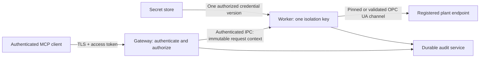

# RFC 0001: Identity and isolation before a remote gateway

- **Status:** Proposed; review and acceptance are required before implementation
- **Date:** 2026-10-03
- **Decision owner:** Repository maintainer; acceptance has not been recorded
- **Tracks:** [#148](https://github.com/IndustriAgents/OPCUA-MCP/issues/148)
- **Gates:** [#14](https://github.com/IndustriAgents/OPCUA-MCP/issues/14),
  [#15](https://github.com/IndustriAgents/OPCUA-MCP/issues/15),
  [#88](https://github.com/IndustriAgents/OPCUA-MCP/issues/88)
- **Support model:** [ADR 0001](../adr/0001-two-first-class-runtimes.md)

## Present boundary and proposed decision

The shipped product is a local MCP stdio process serving one MCP client context
and one configured OPC UA endpoint. The OPC UA server may be on another machine;
"local" describes the MCP transport, not the plant endpoint. Each client starts
its own process and OPC UA session. An operator label is configured attribution,
not an authenticated person. Neither forwarding stdio over a network nor sharing
that process creates authenticated multi-client service operation.

Retain that deployment as the default. A future remote product must have a
separate gateway entry point, configuration schema and security review. It must
establish authenticated request identity and isolated endpoint workers before
exposing HTTP, endpoint selection or pooled sessions. This document specifies
that boundary; it does not enable a listener or add a tool argument.

Options considered:

| Option | Benefit | Cost / reason |
|---|---|---|
| Separate local processes, one per endpoint | Existing bounded, simple ownership | Sessions grow with local clients; this remains the supported product |
| Add HTTP or an endpoint argument to the existing server | Small initial change | Process-wide policy and credentials cannot authorize a caller; reject this approach |
| Gateway with isolated workers and authenticated routing | Explicit ownership and failure containment | Additional identity provider, supervisor, durable audit and operating responsibility; proposed future design |
| Pool all clients in one OPC UA session | Fewer licensed sessions | OPC UA identity, subscriptions and failure state become shared; reject cross-principal pooling |

## Trust boundaries and ownership

An identity provider establishes MCP identity. A secret store supplies OPC UA
credentials. The gateway routes and authorizes but holds no reusable plant
password in logs or requests. A worker owns the client library and its network
state. The supervisor restricts a worker's egress and bounds its CPU, memory,
file access and lifetime. Separate OS processes are the minimum boundary;
containers alone do not replace authentication or policy evaluation.

| Object | Owner / key | Mandatory rule |
|---|---|---|
| Tenant | Server-admin assigned tenant ID | A token claim is mapped through trusted configuration, never accepted as an arbitrary tenant selector |
| Principal | Validated issuer + subject, within tenant | Immutable verified identity on every request; display names and operator labels grant no authority |
| Endpoint registry entry | Tenant + stable endpoint ID + registry revision | Admin-controlled URL, expected ApplicationUri, server trust, allowed networks, policy and secret references |
| OPC UA credential | Tenant + endpoint + principal binding + credential version | Least-privileged username/X.509 identity; never supplied as a tool argument |
| Effective policy | Tenant + principal + endpoint + policy revision | Intersection of role, endpoint and tool/value limits; deny by default |
| Worker / OPC UA session | Tenant + principal + endpoint + credential version + policy revision | Never shared across different isolation keys, even if credentials happen to be identical |
| Subscription / buffered data | Isolation key + random handle + owner client context | Check ownership on read, cancel and notification delivery; handles are not credentials |
| Namespace, capability, metadata cache | Isolation key + registry revision + session generation | Invalidate on replacement; never reuse another worker's namespace indexes |
| History continuation state | Owner + endpoint + query digest + generation + expiry | No native serialized objects; release on completion, cancel, expiry and shutdown |
| Audit record | Tenant-scoped durable stream | Verified principal, service instance, isolation key, endpoint and revisions accompany each decision |

Routing is performed from an authorized registry ID before creating a worker.
No request may supply an OPC UA URL, trust material, private key, password or
endpoint discovery redirect. Discovery results must match the registered URL,
network allowlist and expected identity before connecting. DNS resolution and
outbound firewall checks enforce registry restrictions for every reconnect.

## Identity, delegation and request execution

For a future HTTP transport, use an OAuth resource server with an approved
issuer and a token audience bound to this gateway. Validate issuer, signature,
audience, lifetime and scopes on every request; the MCP client-provided name and
session/connection identifiers provide no authorization. Return 401 for invalid
identity and 403 for insufficient permission. Follow the chosen protocol's
[authorization specification](https://modelcontextprotocol.io/specification/2026-07-28/basic/authorization).

Map the verified principal through administrator-controlled endpoint role
bindings. A role authorizes specific tool classes and URI-based node targets,
not all nodes on every endpoint. Resolve `nsu=` identifiers against that worker's
current NamespaceArray. Gateway policies must reject namespace-index-only
allowlist entries; namespace indexes are not stable endpoint-independent
identities. Namespace-zero identities can be represented with the standard
namespace URI. A tool may accept an index only after resolving it in the selected
session and comparing its URI identity to the authorized target.

OPC UA username or X.509 identities are separate from MCP tokens. Never pass an
MCP bearer token to a plant server. Delegation is an explicit administrator
binding to an endpoint credential version. A shared service account is allowed
only if its privileges fit every bound principal; it does not permit sharing
sessions or buffers across principals. Audit records retain both verified MCP
identity and the OPC UA identity reference, never its secret.

Before sending an operation, execution must:

1. Authenticate; bound and validate the request; allocate a gateway correlation ID.
2. Resolve an endpoint the principal may access; acquire its isolation-key worker.
3. Check capacity, current connection generation and required capabilities.
4. Evaluate current endpoint policy, URI targets and value bounds.
5. Durably record the allowed control decision. Audit refusal prevents dispatch.
6. Execute once through the worker's OPC UA adapter; normalize the result/error.
7. Record completed, failed or uncertain outcome with attempt and generation.

On reconnect, bind namespaces, authenticate the peer and refresh capabilities,
then re-authorize before a retry. Only the contract's read `resend` policy may
retry. Writes, methods and alarm actions are never replayed after a lost answer,
worker crash, HTTP reconnect or supervisor restart. Client cancellation after
control dispatch does not prove failure: finish bounded accounting and record
an uncertain outcome if the answer is lost. Do not invent idempotency guarantees
from a client-supplied request ID.

Credential/trust revocation terminates affected workers and subscriptions.
Policy removal cancels queued requests immediately; in-flight controls are
accounted for rather than silently restarted. Rotation starts a new credential
version, validates it, then drains the old worker. Rollback requires another
audited administrative change; failed rotation never falls back to weaker trust.

## Sessions and subscriptions

Pool only within an identical isolation key. The initial gateway design creates
one OPC UA session per worker; a lower endpoint quota refuses admission rather
than sharing another principal's identity. Idle expiration releases subscriptions,
continuation points and the session. A subscription lease cannot outlive token
expiry without freshly authenticated renewal by its owner. Disconnect starts a
bounded lease expiry; reconnection requires the same verified owner and an
unexpired opaque handle. Owner logout/revocation deletes leases immediately.

Subscription buffers and drop counts belong to their owner. Server event fields
and resource contents are untrusted plant data; they cannot change routing,
policy, identity or tool dispatch. Namespace reorder, session replacement and
endpoint replacement discard all caches. Stateful continuation tokens must bind
the complete ownership/query key above. Existing stateless raw-history follow-up
arguments may remain stateless, but every follow-up still authenticates and
authorizes the endpoint and node anew.

## Transport versions and TLS termination

Both first-class runtimes must pass the same gateway authorization and isolation
fixtures before release. Do not assume their SDK transports are interchangeable:
[declared SDK generations](../compatibility.md#runtime-differences) currently
use different protocol revisions.

Pin and test each supported wire revision. The
[2025-11-25 transport](https://modelcontextprotocol.io/specification/2025-11-25/basic/transports)
uses connection-scoped sessions; the
[2026-07-28 transport](https://modelcontextprotocol.io/specification/2026-07-28/basic/transports)
uses request metadata. The gateway's own ownership model is independent of either.
A legacy MCP session ID must be bound to its verified owner; it is never an
identity. New-revision body/header metadata must be validated by its version's
transport implementation. Unknown versions fail explicitly; downgrade cannot
weaken authorization, ownership or replay protection.

Require TLS at the public boundary. Termination at a reverse proxy is allowed
only with authenticated, encrypted proxy-to-gateway transport or a protected
same-host socket. Reject direct access to the backend. Strip externally supplied
identity/forwarding headers and accept proxy metadata only from the configured
proxy. The gateway validates tokens itself; a proxy's display-name header is
insufficient. Validate Host and any supplied Origin against configured allowlists;
reject invalid origins with 403 and restrict browser CORS. A missing Origin does
not exempt a non-browser request from authentication. Bind development listeners
to loopback. Follow MCP's
[security guidance](https://modelcontextprotocol.io/docs/2025-11-25/tutorials/security/security_best_practices)
for token passthrough, session hijacking, SSRF and stdio proxies.

## Availability, quotas and overload

All budgets are required in the future gateway config; no unlimited queue or
retry setting is accepted. The deployment must set per-principal and per-endpoint
request rates, active sessions, subscriptions, in-flight operations, response
bytes, buffered bytes and timeouts. A global budget bounds the aggregate. A
worker retains existing contract request, history, traversal and transport limits;
a gateway budget may only lower them.

Use bounded per-isolation-key queues and fair scheduling across principals, with
separate bounded read/history capacity and reserved control/diagnostic capacity.
Reservations still require authorization. Large history or browse work cannot
consume all diagnostic slots. Reject before dispatch when a queue or quota is
full: HTTP 429 with bounded retry guidance for caller limits, 503 for unavailable
endpoint/global capacity. There is no silent drop or infinite wait. Refused
controls are audited as not sent. Once a control starts, overload/cancellation
never triggers a resend.

A response budget reports truncation using the shared completeness model;
subscription overflow records dropped counts. Memory limits include pending
responses, notification buffers and caches. Slow readers lose only their own
bounded stream/lease; they cannot retain an unbounded backlog. Endpoint failure
opens an endpoint-specific circuit breaker and bounded backoff. Other endpoints
remain routable; global exhaustion produces explicit admission refusal.

## Operations and audit

Health reports distinguish gateway liveness from endpoint readiness. A healthy
process may report endpoint offline, authentication failed or quota saturated.
Only authorized operators see endpoint identity, reasons and registry metadata.
Metrics report counts, durations, queue lengths, reconnect generations and audit
health. They omit node values, credentials, tokens, certificate private material
and principal names; tenant labels are allowlisted and cardinality-bounded.

Control audit records include server-derived tenant/principal/issuer, service
instance, endpoint ID, registry/policy/credential revisions, session generation,
correlation ID, attempt, URI targets, decision and outcome. Worker IPC must
preserve authenticated request context. Client labels remain a separate unverified
field. Use tenant-separated access control, durable acknowledged writes and
retention/export rules. Audit outage stops controls; diagnostic access may
continue under its policy. Neither audit streams nor metrics carry plant values.

Administrative config changes authenticate a separate management principal.
Validate a complete immutable revision before atomic activation and record who
changed its digest. Queued operations re-evaluate the activated revision.
Endpoint URL/identity or secret changes replace workers; harmless logging changes
do not authorize access. Partial reload is refused. Provide rollback, credential
rotation, incident revocation and shutdown procedures before deployment.

## Threat model and required evidence

Assets: plant control integrity, readings, identity, secrets, audit provenance and
bounded availability. Potential attackers include an unauthenticated network
client, one authorized but malicious principal, a compromised endpoint, a browser
performing DNS rebinding, and a compromised worker. The identity provider,
registry administrator, supervisor and durable audit service are trusted parts of
the deployment; their compromise requires revocation and incident recovery.
Network access or a signed plant value never confers control permission.

| Threat | Control | Acceptance test before gateway release |
|---|---|---|
| Forged/expired/wrong-audience identity | Verify every request; no client-provided identity | Reject forged issuer, signature, tenant and audience on every supported SDK revision |
| Confused deputy / token passthrough | Endpoint-role mapping; distinct OPC UA credentials | MCP token cannot become plant identity or be logged/forwarded |
| Cross-tenant endpoint selection | Registry authorization before worker acquisition | Tenant A cannot route, enumerate or probe tenant B's endpoints |
| Namespace-index collision | URI allowlists scoped to endpoint/generation | Identical index/id on two endpoints never grants cross-endpoint control; reorder re-authorizes |
| Session/subscription theft | Owner-bound opaque handles and isolation keys | Another principal cannot read, drain, cancel or resume a subscription or legacy session |
| Stale continuation or cache | Query/revision/generation/expiry binding | Reconnect, policy change and expiry refuse stale state and release server points |
| Endpoint spoofing / redirected discovery | Per-endpoint trust, expected URI and egress rules | Impostor, identity mismatch and unregistered discovery target fail closed |
| SSRF through endpoint parameters/DNS | Admin-only registry and reconnect egress checks | Tool URL, redirect and DNS change cannot reach an unregistered service |
| Credential rotation/revocation race | Versioned workers and atomic replacement | Revoked identity cannot keep a session or queued control; no insecure fallback |
| Lost control response or worker crash | No control replay; durable attempt accounting | Drop answer after actuation: one send and uncertain outcome, including cancellation/restart |
| Queue flood / slow consumer / reconnect storm | Hierarchical budgets and fair scheduling | Saturating one principal/endpoint leaves reserved diagnostics and other endpoints available |
| Audit failure / spoofed label | Durable fail-closed control audit, verified context | Audit unavailability sends no control; label spoofing does not alter recorded principal |
| TLS proxy bypass / DNS rebinding | Protected backend, validated headers and Origin | Direct backend and forged forwarding/Origin requests fail; no unauthenticated session reuse |
| Malicious server payload / event content | Transport bounds, inert data, process restriction | Oversize reply kills only its worker; event text cannot select endpoint or issue control |
| Worker compromise | One isolation key, egress/secret/process restrictions | Worker cannot read another tenant's secret, IPC context, cache or audit stream |

Threat-model tests must exercise two tenants, two principals, two endpoints and
namespace collisions simultaneously on both runtimes. Fault injection must lose
responses after actual dispatch; mocks that fail before dispatch are insufficient.
Keep resource/fairness tests deterministic and publish the configured budgets
alongside results. Successful OPC UA authentication does not prove MCP isolation.

Residual risks: an authorized control can still be operationally wrong, a
compromised registered endpoint can falsify readings, and the trusted supervisor
or identity provider can undermine every isolation key. Endpoint policy and plant
interlocks remain separate controls. Initial per-principal isolation consumes more
licensed sessions than global pooling; quotas make that cost explicit.

## Migration and approval gate

Local users keep `OPCUA_SERVER_URL`, stdio, existing tools and per-process policy.
Multiple local endpoints remain separate named MCP client entries/processes.
No OAuth provider, gateway registry or supervisor is needed for that path.
Remote operator labels cannot be promoted into verified principals.

A later gateway preview uses an opt-in executable/config namespace and starts
observe-only. It must not silently reinterpret local environment credentials as
multi-tenant credentials. Endpoint selection has an explicitly versioned contract;
the local tool surface stays stable. Qualified control is enabled only after
identity, audit, isolation, uncertainty and overload evidence passes on both stacks.

Before reopening #14, #15 or #88 for implementation:

- Record maintainer/security review and acceptance of this RFC on its PR.
- Resolve every threat-model row with testable implementation ownership and budgets.
- Publish a protocol/SDK compatibility matrix and a deployment/rotation plan.
- Link feature issues to this gate, with dependent acceptance criteria.

Those feature issues cannot close independently of the gateway security evidence.
#148 remains open until review/acceptance is recorded. A merged draft document
alone does not assert approval or shipped gateway support. Revisit the design if
per-principal session cost makes it unworkable; any weaker pooling boundary needs
a new threat model and proof of equivalent authorization, never an undocumented
optimization.
